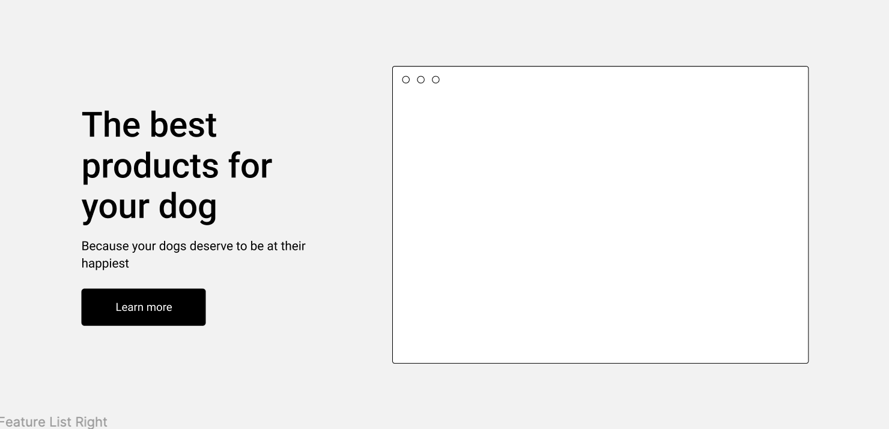
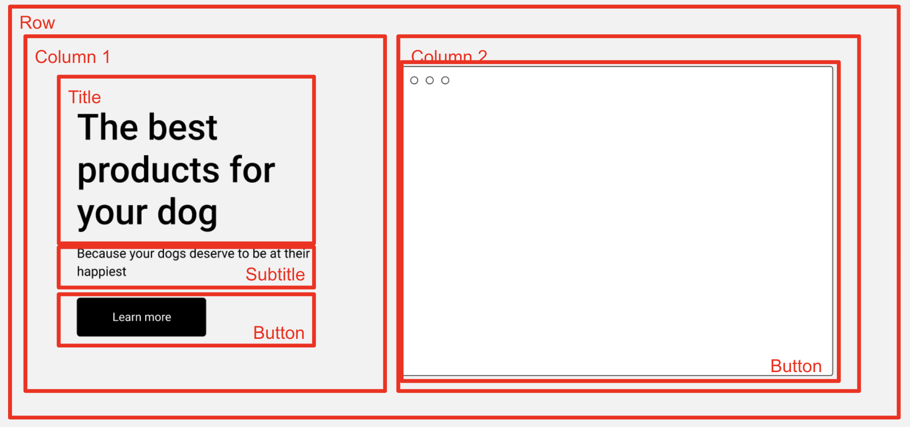
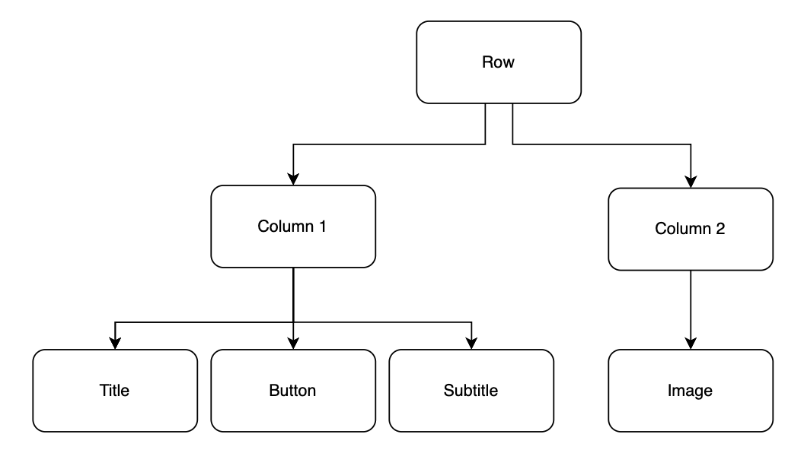

# Laying out HTML

Now we're going to start talking about planning how to layout your page. A couple of extra minutes upfront can save you hours of headaches later on.

By the end of this, you should be able to:
- look at an image that you're trying to recreate, and split it up into rows and columns visually or as a Tree of elements.
- take your tree of elements, and write it as HTML as elements
- convert that HTML into rows and columns using Bulma CSS
- style your elements using Bulma

It is important to remember that writing HTML and deciding which elements go where are 2 separate tasks. You might try to do them at the same time, but it won't look right.

My preference is to sketch something out on paper or in a tool like Figma, and then implement it according to my paper scribbles. This is usually faster than trying to write it and deciding where it should go.

## Rows and Columns

In this unit, we're going to be working through implementing a provided prototype. Take a look at [this prototype on Figma](https://www.figma.com/file/H85eC9Nup1D780yoHIzlBh/CS-5356-Prototype-%231?node-id=632571%3A639&t=BRyBAgk6xCn0zvKE-0), for example.

The first step to take is to divide up the page into rows and columns. And the you divide each row into more rows and columns, until enough things are on the page. The only catch - A column cannot contain 2 rows. A column can only exist in one row at a time.

Let's start here...



How would you split this up into rows and columns? Here's how I would tackle it.



Here's the main things to pay attention to

- All of the elements in this row have to belong to a parent element, so we have an outer-level Row.
- This Row has 2 Columns. According to the specs of the prototype, technically one side is slightly wider than the other
- Column 1 contains the real elements - 2 pieces of text, and a button, stacked vertically and centered.
- Column 2 contains an image

Here's what it might look as a Tree of HTML



With these two diagrams, you might start to see how to implement the HTML to match the source.

## Boxes & Words, Rows and Columns, Style

Once I've broken down the image into Rows and Columns, I'm ready to start writing. I do this in 3 passes:
- Boxes & Words
- Rows & Columns
- Style

### 1. Boxes and Words

Once you've done the Outline of your Rows and Columns, create the HTML to match it and ignore the CSS for now. You can use text as a placeholder for elements until you're finished with the general structure.

Here's what that looks like in HTML:

```html
<!-- Row 1 -->
<div>
  <!-- Column 1 -->
  <div>
    <!-- Child #1 -->
    <div>
      Title
    </div>
    <!-- Child #2 -->
    <div>
      Subtitle
    </div>
    <!-- Child #3 -->
    <button>
      Button
    </button>
  </div>
  <!-- Column 2 -->
  <div>
    <div>Image</div>
  </div>
</div>
```
- One parent `div` with 2 child `div` representing each column
- Each column is a `div` containing the "real" elements
- Column 1 contains 2 child `div` representing the text elements
- Column 2 contains 1 `div` representing the image we'll use

### 2. Turn Boxes into Rows and Columns

Using Bulma CSS and its [grid system](./static-sites.md#grid-system), you can use the `columns` CSS class to create a row, and use the `column` CSS class in a nested element to create a column in that row.

Here's what that looks like

```html
<div class="columns">
  <div class="column">
    <div>
    Title
    </div>
    <div>
    Subtitle
    </div>
    <button>
    Button
    </button>
  </div>
  <div class="column">
    <div>Image</div>
  </div>
</div>
```
- The outermost parent element became the row with `class="columns"` (columns with an s - plural)
- The 2 children became columns with `class="column"`

I wish they would have used the word row instead of `columns`, but :shrug:

### 3. Style

Now that things are roughly in the right place, we can start to add some style to it. Here's how the last finishing touches get it to match

```html
<div class="columns has-background-light p-6 is-vcentered">
  <div class="column is-5 ml-5">
    <div class="title has-text-dark">
      The best products for your dog
    </div>
    <div class="subtitle has-text-dark">
      Because your dogs deserve to be happy too
    </div>
    <button class="button is-dark">
      Learn more
    </button>
  </div>
  <div class="column">
      
  </div>
</div>
```
View this as a live example on [this Codepen](https://codepen.io/intricatecloud/pen/NWBMajK?editors=1000)

- The parent row gets:
  - `has-background-light` ([docs](https://bulma.io/documentation/helpers/color-helpers/#background-color)) for the off-white color of the background
  - `is-vcentered` ([docs](https://bulma.io/documentation/columns/options/#vertical-alignment)) to center its children vertically within the row
  - `p-6` ([docs](https://bulma.io/documentation/helpers/spacing-helpers/)) to give some extra padding on the sides (see what happens when you omit this)
- The first column gets:
  - `is-5` to have this column occupy 5 columns of grid space
  - `ml-5` to push the text slightly further from the left
- The children of the first column get:
  - `title` for a heavy font with larger text
  - `subtitle` for a smaller, thinner font meant to go under the title
  - `has-text-dark` for a darker (but not black) font to be able to see the text
  - The button gets `button is-dark` to create a button that doesn't look like its from the 90s with a dark background.
- The child of the second column winds up being fine as it is

While this exercise is useful to show you the effects of the different CSS classes, there are other useful elements provided by Bulma.

One of them is a Hero image which lets you create small, medium, and large sections of the page without having to jump through too many hoops. Take a look at the examples on [this Layouts page on the Bulma docs](https://bulma.io/documentation/layout/hero/) and look at Hero.

Now - your turn to practice in the next section.