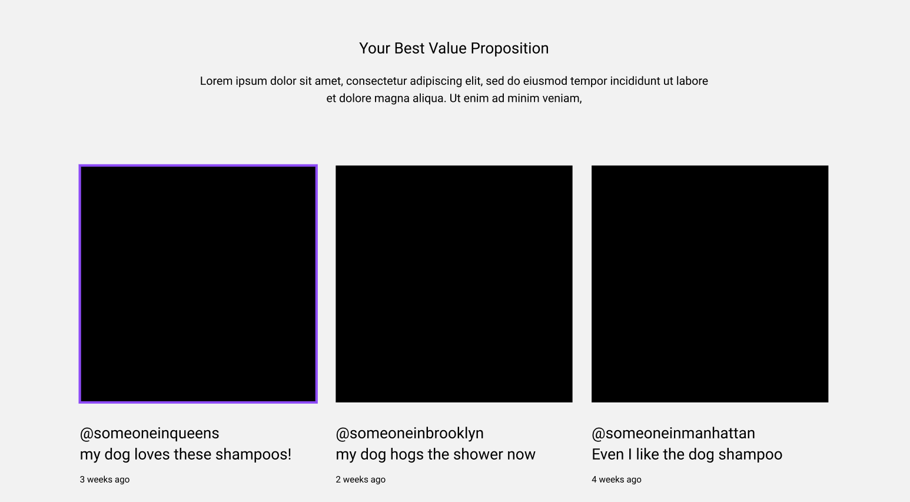

# Practice

For this activity, you'll implement a part of the wireframes that we viewed in the Project Plan using HTML & Bulma CSS.

Here's an example we looked at in class:



You can start with this Codepen Template of an HTML page which includes Bulma CSS already - https://codepen.io/intricatecloud/pen/mdjLOLo

If you'd like to work locally instead, you can use this as your baseline (copied from the codepen):
```html
<html>
<head>
  <link rel="stylesheet" href="https://cdn.jsdelivr.net/npm/bulma@0.9.4/css/bulma.min.css">
</head>
<body>
  <div>Start writing your content here!</div>
</body>
</html>
```

The only things you'll need to complete these tasks is
- the Bulma docs on [the grid system](https://bulma.io/documentation/columns/basics/)
- the Bulma docs on [colors](https://bulma.io/documentation/helpers/color-helpers/)


<details>
    <summary>
    View examples from real students when you're done
    </summary>
    <p>https://codepen.io/jm2455/pen/yLqjMqm</p>
    <p>https://codepen.io/jackiejiaqiliu/pen/RwBypgZ</p>
</details>