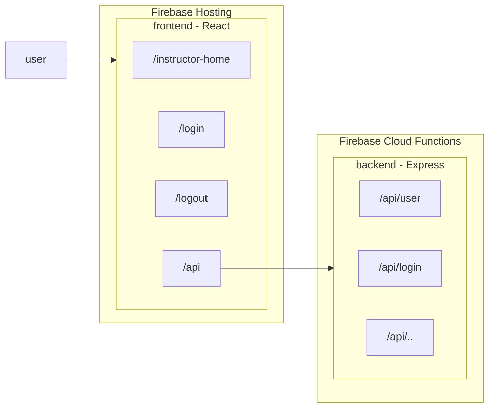

# App Mermaid

```mermaid
graph LR
  user --> frontend

  subgraph cf["Firebase Cloud Functions"]
    subgraph express["backend - Express"]
      direction RL
      route["/api/user"]
      route1["/api/login"]
      route2["/api/.."]
    end
  end

  subgraph hosting["Firebase Hosting"]
    subgraph frontend["frontend - React"]
        instructor-home["/instructor-home"]
        login["/login"]
        logout["/logout"]
        api["/api"] --> express
    end
  end
```