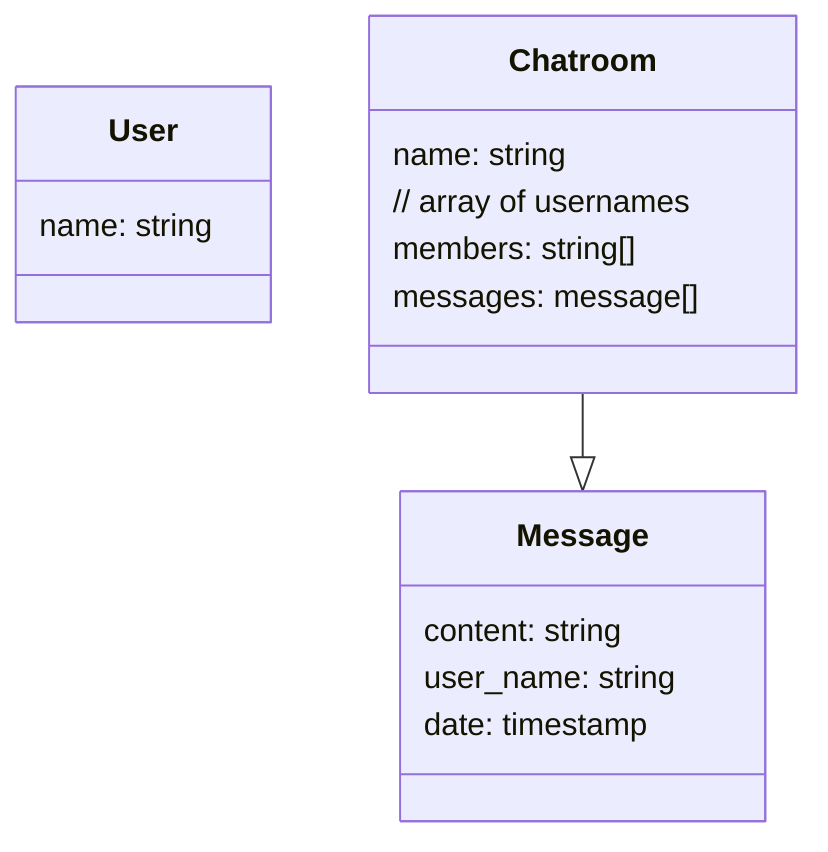

# Defining the Data Model

Once you know the use cases that you have to support for your application and what you want it to look like, I find a good next step would is to dig into the data structures that you need and see if the data can support the use cases.

## Getting started

This process has 3 general steps:

1. Identify the Domain Objects in your app
2. Outline the names and properties of the different Domain Objects
3. Structure the data as a JSON object and use some code to see if it works for your use case.

### Identify Domain Objects

A domain object refers to a group of data that your application needs to interact with.

For example:
* Trello - Boards, Lists, and Cards
* Wordpress - Blog, Posts, Pages
* Google Slides - Slides, Slide, Content

As you look at the use cases for your application, try to identify the types/groups of data that you need.

### Outlining a Domain Object

Once you know the name of the groups of data that you need, you can start giving them some properties.

Back to the Trello example:
* A Board has a name, and can have multiple Lists
* Lists can have a name, and can have multiple Cards
* Cards have titles, descriptions, authors, timestamps

### Structure the data as JSON

Here's an example of one way of describing the Trello domain objects. I've described:
* a CS 5356 To Do Board
* with 3 lists - "Not Started", "Doing", "Done"
* and one Card titled "Milestone 1" in the "Not Started" list

```json
{
  "board": {
    "name": "CS 5356 To Do",
    "lists": [{
      "name": "Not Started",
      "cards": [{
        "title": "Milestone 1",
        "description": "",
        "author": "da335",
        "timestamps": "2023-02-01"
      }]
    }, {
      "name": "Doing",
      "cards": []
    }, {
      "name": "Done",
      "cards": []
    }]
  }
}
```

Once we have a prototype of the data for our app, we can start writing some code to build towards it. This step is the same whether you're working on a relational database like MySQL, or a non-relational database like Firebase Firestore.

Let's walk through an example where you can build that structure out yourself.

## Example: A Chat Application like WhatsApp

Let's start by taking a look at an example - a chat application.

Here are 3 user stories that we would like to support in our chat app:
* As a user, I can join and view chat rooms that I’m a part of
* As a member of a chat room, I can send and receive messages
* As a user, I can view members of a chat room that I’m a part of

### 1. Identify Domain Objects

What might you consider to be the bits of data that you need to work with? At this stage, you can describe in plain english.

<details>
  <summary>
  View an example
  </summary>
  <p>
  Users, User Names, Chat Room Names, and Messages, Message Timestamps, Message Content
  </p>
</details>

### 2. Outline the data you may need

For every Domain Object, outline the properties you may need. At this stage, theres no such thing as a wrong answer - the point of the exercise is to consider what information you may need. You'll find out later on if this works or not.

<details open>
  <summary>View an Example</summary>
  <p>



  </p>
  <p>
    <li>A User would have a name.</li>
    <li>A Chatroom would have a name, a list of members by name, and messages.</li>
    <li>A message would have the content of the message, the name who sent it, and a date when the message was sent</li>
  </p>
</details>

### 3. Structure the data as JSON

Based on your description above, try to describe it as JSON. Here are some guidelines to help you start:

1. Start with an empty JSON object. This will represent your entire database:

```json
{}
```

2. Add a Property for every Domain Object you may have. You can imagine that the equivalent of this could be a table in a SQL database, a Collection in a NoSQL database, or even a Sheet in a Spreadsheet.

```json
{
  "users": [],
  "chatrooms": [],
  "messages": []
}
```

3. Create a User by adding a `user` to the `users` array - `{"name": "da335"}`

```json
{
  "users": [{
    "name": "da335"
  }],
  ...
}
```

4. Add a `chatroom` by creating a `chatroom` object within the `chatrooms` array - `{ "name": "class-channel" }`

```json
{
  "users": [{
    "name": "da335"
  }],
  "chatrooms": [{
    "name": "class-channel",
    ...
  }]
}
```

5. Send a `message` by creating a `message` object within the `messages` array - `{ "content": "hello!" } `

```json
{
  "users": [{
    "name": "da335"
  }],
  "chatrooms": [{
    "name": "class-channel",
    ...
  }],
  "messages": [{
    "content": "hello!",
    ...
  }]
}
```

### 4. Define the Relationships
For our use case, Chatrooms can have many messages. This is called a One-To-Many relationship. You can model this relationship in 2 ways:

A) Make a `chatroom` contain the `messages` array

```json
{
  "chatrooms": [{
    "name": "class-channel",
    "messages": [{
      "content": "hello!"
      ...
    }]
  }]
}
```

* B) Add a `chatroomName` to `message` to serve as a pointer for the chatroom where the message was asked.

```json
{
  "messages": [{
    "content": "hello!",
    "chatroomName": "class-channel",
    ...
  }]
}
```

Either one is perfectly valid and is possible in either Relational/NoSQL databases. It depends on how you want to save your data.

<details>
<summary>
View a finished example
</summary>
<p>

```json
{
  "users": [{
    "name": "da335"
  }],
  "chatrooms": [{
    "name": "2023-cs-5356-class",
    "members": ["da335"],
    "messages": [{
      "content": "hello world!",
      "name": "da335",
      "timestamp": "2023-02-01"
    }]
  }]
}
```

</p>
</details>
