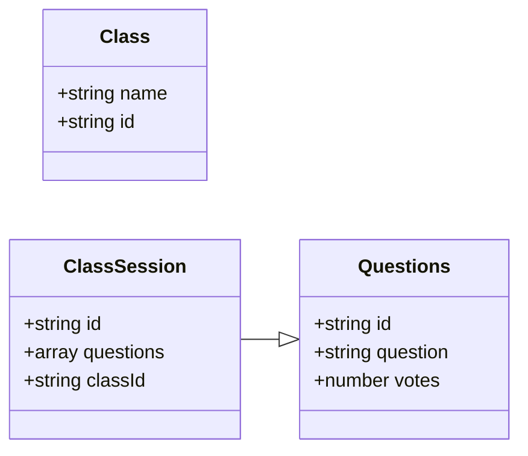

# Exercise: Define the Data Model

Let's follow the same set of steps to put together the data model for our Milestone 2 project. Review the [wireframes](./../project-plans-wireframes.md) and the use cases outlined there and attempt to answer the questions below.

1. Identify the Domain Objects
2. Outline the data you may need
3. Structure the data as JSON
4. Define any relationships

User stories to keep in mind:

* As a student, I can ask a question (with my name or anonymously) for a particular class
* As a student, I can view questions being asked for a particular class session
* As a student, I can upvote or downvote a question
* As an instructor, I can view questions (and upvotes) that students are asking for a particular class session
* As an instructor, I can view who asked a particular question
* As an instructor, I can view my classes & class sessions
* As an instructor, I can create a class session


<details>
<summary>
View the results from class
</summary>
<p>1. Identify the Domain Objects</p>

<p>Student Questions, Classes, and Class Sessions</p>
<p>2. Outline the data you may need</p>



<p>3. Structure the data as JSON </p>
<p>

```json
{
  "classes": [{
    "name": "cs5356"
  }],
  "classSessions": [{
    "classId": "cs5356",
    "questions": [{
      "name": "danny",
      "question": "why is the sky blue?",
      "votes": 0
    }]
  }]
}
```

</p>

<p>4. Define the relationships</p>

Class Sessions have a pointer named `classId` to the class that it belongs to.

</details>