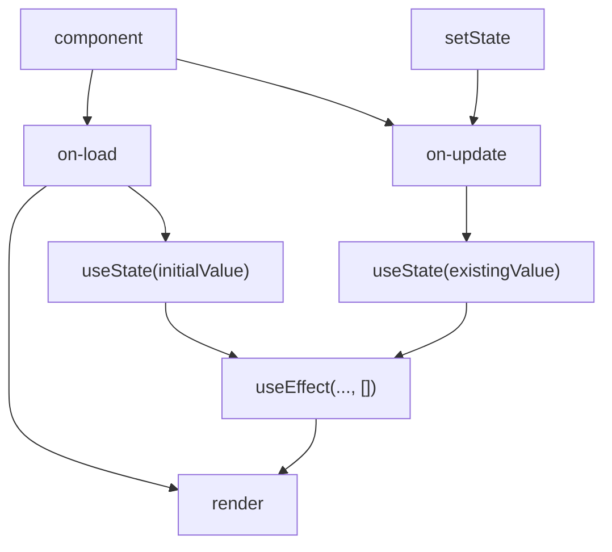

# Display the data from the API

Now, we'll update our `ViewPage` component to fetch the data from an existing API. To accomplish this, we'll be using `useState`, `useEffect`, and `fetch` to make this happen in a React component.

## Add useState

When we want to fetch and display data, we have a "stateful" component.

Let's add a piece of state to `ViewPage` to represent the currently displayed list of questions, and the initial value will be an empty array.

```jsx title=pages/view.js
import { useState } from 'react'

export default function ViewPage() {
  const [currentQuestions, setCurrentQuestions] = useState([])

  return (
    <div><QuestionsList questions={currentQuestions} /></div>
  )
}
```

## Add useEffect

The next feature of React you'll look into is the `useEffect` hook. This allows you to run a function _as a side effect_ of something happening to your component.

In your case, what you want is to run a function _as a side effect_ of the component loading. And we can accomplish that with the `useEffect` hook.

Add a `useEffect` block to your component like the example below

```jsx title=pages/view.js
import { useState, useEffect } from 'react'

export default function ViewPage() {
  const [currentQuestions, setCurrentQuestions] = useState([])

  useEffect(() => {
    // you can do the fetch here

  }, []) // <- the empty array here means run this code after the component loads

  return (
    <div><QuestionsList questions={currentQuestions} /></div>
  )
}
```

Here is a diagram that outlines how useState and useEffect work with the component lifecycle.



## Add fetch()

Now, you can combine the three of these snippets together. We're going to use the `GET /api/class-codes/:class-code/questions`.

Call `fetch()` to get the data from the API within the `useEffect` block, and then save it to the component's state using `setCurrentQuestions(updatedValue)` once the `fetch()` promise resolves.

```js
useEffect(() => {
  // you can do the fetch here
  fetch(`/api/class-code/${classCode}/questions`)
    .then(response => response.json())
    .then(questionsData => setCurrentQuestions(questionsData))

}, []) // <- the empty array here means run this code after the component loads
```

Here's what it would look like with async/await syntax if you want to avoid the Promise pattern
```js
...
const getQuestions = async () => {
  const response = await fetch('/api/class-codes/${classCode}/questions')
  const questionsData = await response.json()
  setCurrentQuestions(questionsData)
}

useEffect(() => {
  // you can do the fetch here
  getQuestions()
}, []) // <- the empty array here means run this code after the component loads

...
```

After you call `setCurrentQuestions`, under the hood, React will re-render your component because the state has now changed, and anywhere you use `currentQuestions`, you'll see the latest values displayed.

At this point, you should see a list of sample questions provided by the API.
