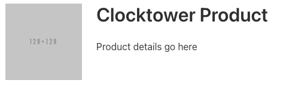

# Intro to React

## What is React?

React is a UI Library for Javascript to make it easier to create interactive websites, especially when you're displaying data from a remote URL and displaying it dynamically.

For Milestone 2, you'll be writing very little React, but enough to get familiar with it. If you're new to React, then read on. If you've already worked with it, feel free to skip this.

:::success

For the most up-to-date explanations and quality tutorials & documentation, refer to the [React docs](https://react.dev/learn).

This guide assumes that you've read [the quick start.](https://react.dev/learn)

:::

## Why use it at all?

It is possible to build web applications without UI libraries or complex-looking frameworks just to put together some HTML. But its hard to get right.

In previous years, we used Express with EJS templates (similar to Flask HTML projects in Python) to build a server that replied to both API requests and HTML requests. This is easier to get started with, but unfortunately, limits you over the long term.

But for web applications, you hit a point where you want more interactivity in your app, and then you start to run into various limitations of this architecture. The answer you usually find is to use a single-page-app framework like React instead, but by this point, its too late to change course.

React has a little bit of a learning curve, but leaves you with more opportunity to grow over the long term, as long as you're fine with writing Javascript.

:::info

And by the way, if you don't like React or it doesn't make sense to you, try one of the other view libraries like [Vue](https://vuejs.org/), [Svelte](https://svelte.dev/). They all share similar concepts with a different syntax to write it.

:::

# Creating Components with React

In this section, we'll go over the basics of React so that you can start creating and using your components in your app.

We were reviewing a snippet of React code below:

```jsx
const ProductElement = (props) => {
  return (
    <div class="column">
      <figure class="image pr-5" style="width: 128px; height: 128px;">
        
      </figure>
      <div class="title">{props.product.name}</div>
      <div class="subtitle">{props.product.description}</div>
    </div>
    ...
  )
}
...
<ProductElement product={product}>
```

Here's what this component might look like with some test data:



There are a number of things here to notice
* There is a function named `ProductElement` - called functional components
* It has a parameters named `props` - properties that you can "pass" to a component
* It returns what looks like HTML - the syntax is called JSX and it's similar to HTML
* You can then use it as if it was an HTML element

## Component Lifecycle

React takes advantage of a common set of patterns of web development to make it easier to build on the web. One of those patterns is the page lifecycle.

Commonly found in mobile development, you can imagine your web page to have a lifecycle - a set of steps that it follows as it transitions from one state to the next and you leave the page or close the tab, thus completing the lifecycle.

Web pages will generally follow the steps below:
* Download all HTML
* Download any CSS referenced in HTML
* Download any Javascript
* Load CSS
* Load Javascript and execute it
* Fire page onLoad event <- this last step here marks the end of a web page loading. At this point, your React components begin loading.

React components follow their own lifecycle once they start loading.
* Create an instance of a React component
* "Mount" the React component by displaying the "rendered" HTML based on any props
* Update the React component if any props change
* Destroy the React component if it is no longer displayed

## Functional Components

Functional Components refer to Components that are defined as Javascript functions.

There are also Class Components, components that are defined as Javascript Classes, however, they are more verbose to write. It is helpful to see a Class Component and then see how you can write them as a function.

Here's a Class Component, and we'll review how this works based on the Component Lifecycle

```jsx
class NavBar extends React.Component {
  constructor(props) {
    super(props)
    // any component variables go here
  }

  componentDidMount() {
    // run code when the component has finished mounting
  }

  componentDidUpdate(props, newProps) {
    // run code when props have changed
  }

  render() {
    return (
      <nav>...</nav>
    )
  }
}
```

* We define a Class named NavBar that extends React.Component
* We define a constructor that receives props, and forwards it to the parent constructor
* We define a function `componentDidMount` which is called by React when the component has been instantiated and "mounted" to the page
* We define a function `componentDidUpdate` which is called by React when the props passed to the component have changed.
* We define a function `render` which is called by React to return the HTML for the component

Now, let's see in what order these are called.
1. React will instantiate your component first, doing something similar to `new NavBar()`. This will run the code in the constructor and save the instance.
2. React will then call `render` first and return any HTML generated by the function and add it to the page. The component is considered "mounted" at this point
3. React will then call `componentDidMount` and run any custom code.
4. If any props passed to the component have changed, then call `componentDidUpdate` with the current and new props.

It is helpful to know the lifecycle, but it can be lengthy to write, so React offers Functional Components to help simplify this process.

```jsx
const ProductElement = (props) => {
  return (
    <div class="column">
      <figure class="image pr-5" style="width: 128px; height: 128px;">
        
      </figure>
      <div class="title">{props.product.name}</div>
      <div class="subtitle">{props.product.description}</div>
    </div>
    ...
  )
}
...
<ProductElement product={product}>
```

The component goes through all the same lifecycle steps, but the way we read/write the component is different.

* Instead of a Javascript class, the component is written as a function. React will do something similar to `const element = ProductElement(props)`
* When the component is instantiated, it will run the code in the function once and use the returned HTML as the output of the component.
* Once the component is considered mounted, it will run the code in `useEffect`, a React "hook" - a way to hook into the React lifecycle and run some code. This code can cause an "effect" so React will run the "effect" and then return the latest updated HTML.

## HTML & JSX

React uses a syntax named JSX, which is very similar to HTML except for a few small differences.

* React components generally start with a Capital Letter, and HTML elements usually start with a lowercase letter
* Components should return just 1 HTML element, if you need to return multiple, you need to wrap them in a `<div>`
* You can't use the `class=` property in your component, it needs to be `className` - `<button class="button is-primary">` is wrong. `<button className="button is-primary">` is right
* You can use Javascript expressions within your React components, this is where it starts getting really powerful!

Let's take a look at this example, which displays a list of classic books, passing their names as props.

```jsx
const BookList = (props) => {
  return (
    <div>
      <ul>
      { props.books.map(book => {
          return <li>{book}</li>
        })
      }
      </ul>
    </div>
  )
}
...
<BookList books={['The Great Gatsby', 'Frankenstein', 'Oliver Twist' ]}>
```

* You can begin/end a Javascript expression by using `{ }`.
* The first expression is `props.books.map(...)`. This is a way of iterating through each item in the array, and returning HTML for that item.
* You can have nested JSX expressions.
* `book => { return <li>{book}</li> }` . This function returns `<li>` elements, using the name of the book as a JSX expression.

This would produce this output in HTML:

```html
<div>
  <ul>
    <li>The Great Gatsby</li>
    <li>Frankenstein</li>
    <li>Oliver Twist</li>
  </ul>
</div>
```

### React State
Another key feature of React is the concept of "state" which refers to any data that is used by a component that might change later over time.

Every component shown previously is "stateless" - they currently display static data and nothing will change over time.

For example

```jsx
const QuestionDetail = props => {
  return <div>
    {props.questionText} - {props.user}
  </div>
}

<QuestionDetail questionText="When is the assignment due?" user="danny">
```

A component that has data that changes over time is "stateful". React lets you do this with the `useState(initialValue)` hook - this allows you to define a piece of state with an initial value.

Let's say you want to add an Upvote button to display a number of votes for a particular question.


```jsx
const QuestionDetail = props => {
  const [numberOfUpvotes, setNumberOfUpvotes] = useState(0)

  const onUpvoteClicked = () => {
    setNumberOfUpvotes(numberOfUpvotes + 1)
  }

  return <div>
    <div>
      {props.questionText} - {props.user} - {numberOfUpvotes}
    </div>
    <button class="button" onClick={onUpvoteClicked}>Upvote this!</button>
  </div>
}

<QuestionDetail questionText="When is the assignment due?" user="danny">
```

In this example, we have a QuestionDetail component that displays a question, the user who asked it, and the number of upvotes that the question has. We are using the `useState` hook to keep track of the number of upvotes.

Let's break down this statement to understand what's happening:

```js
const [numberOfUpvotes, setNumberOfUpvotes] = useState(0)
```

* `useState(initialValue)` the first parameter is the initial value of this state, in this case, 0.
* `useState` returns an array containing 2 values
* `numberOfUpvotes` represents the latest value of that data (remember this will change over time).
* `setNumberOfUpvotes` represents a setter function that you can call to update that data AND tell React to re-render this component now that the data has been updated.

Here is a more verbose way of writing exactly the same statement if you find yourself confused by the syntax:

```js
const stateProperties = useState(0)
const numberOfUpvotes = stateProperties[0] // the latest value of this state will always be the 0th index
const setNumberOfUpvotes = stateProperties[1] // the function to update the state will always be the 1st index
```
Although its much easier to write it using the shorthand. The convention is to use the same name for the value and for the `set*` function - so if you had a state to represent the current year or month, you could write `const [year, setYear] = useState(2000)` or `const [currentMonth, setCurrentMonth] = useState("October")`