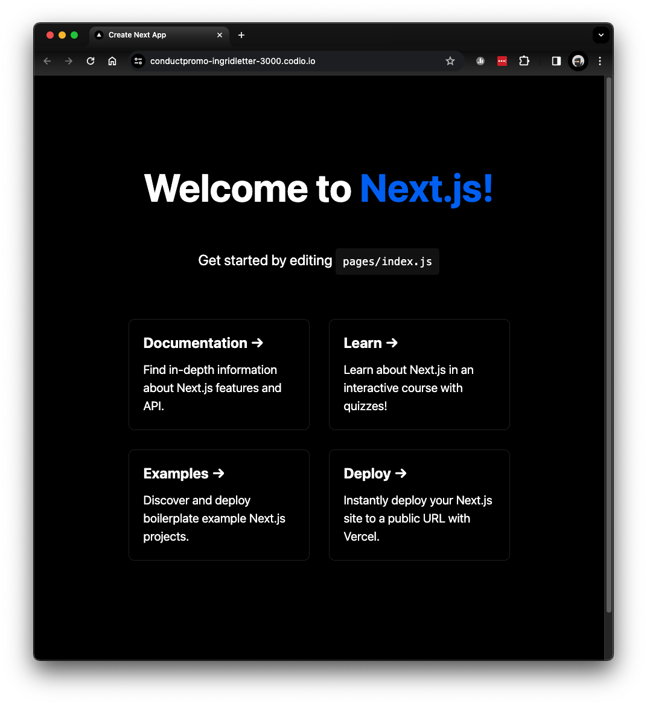
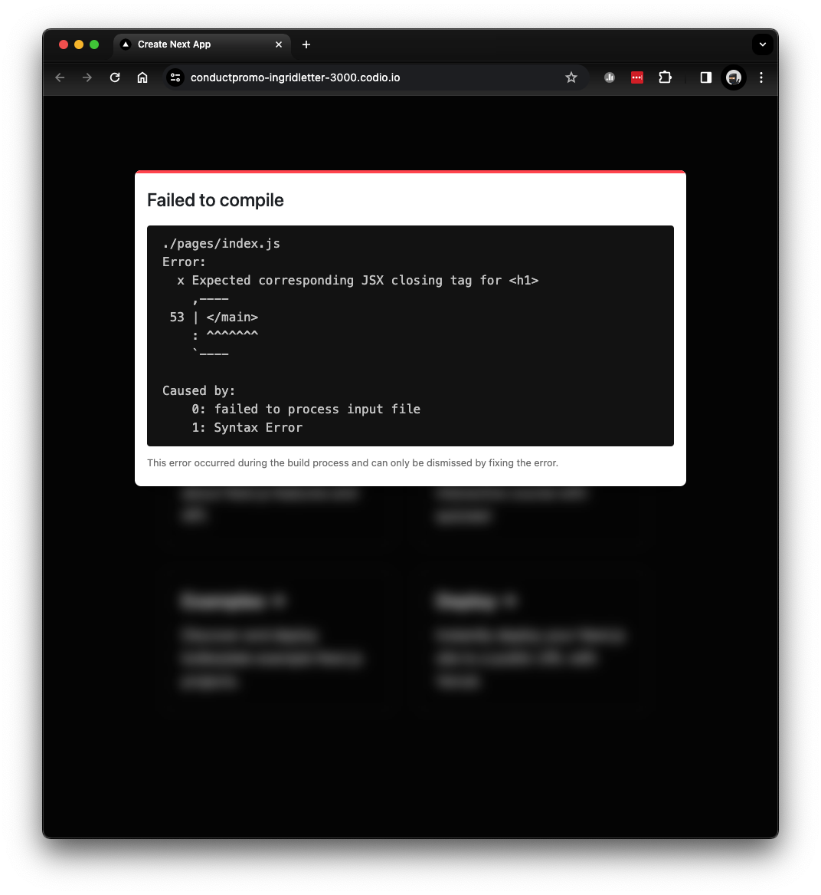

# Using NextJS in Dev Mode

Once you've got a hang for creating user interface components using React, we can start using NextJS to build out our application.

In this page, we'll go over how to use NextJS, some of the features you get from it, and how to get started.

## Getting started with NextJS

The easiest way to get started with a NextJS application is to create one!

```
npx create-next-app@12.3.4 project --use-npm --js
npm install --save next@12.3.4 react@17 react-dom@17
```

This command uses `npx` (a command-line tool provided with NodeJS) to execute a tool called `create-next-app` which will create your NextJS application in a folder named `project`.

Note: This locks the version of NextJS to v12.3.4, along with React & React-DOM to v17 for future compatibility purposes.

Once you've run these commands, run `npm run dev` to run a script named `dev` defined in `project/package.json`. This will run your NextJS application in dev mode which comes with a few features described below to help make debugging easier.

In the output, you'll see something like

```
danny:~/workspace/project$ npm run dev

> project@0.1.0 dev
> next dev

ready - started server on 0.0.0.0:3000, url: http://localhost:3000
event - compiled client and server successfully in 3.5s (174 modules)
Attention: Next.js now collects completely anonymous telemetry regarding usage.
This information is used to shape Next.js' roadmap and prioritize features.
You can learn more, including how to opt-out if you'd not like to participate in this anonymous program, by visiting the following URL:
https://nextjs.org/telemetry

wait  - compiling / (client and server)...
event - compiled client and server successfully in 949 ms (207 modules)
```

This means things are working, and you should be able to view your application using `localhost:3000`.

You should see a page like the one below:



On this page, you'll see some helpful links to docs - you can refer to those later as you explore NextJS.

## Features

### Page Routing

NextJS provides a file-based routing system, which means that the pages defined in your application are based on the folder structure inside your `pages/` folder.

As an example, you can use these URLs:
```
http://localhost:3000/
http://localhost:3000/about-us
http://localhost:3000/blog
http://localhost:3000/blog/resources
```

By creating this folder structure

```
├── pages
│   ├── index.jsx
│   └── about-us.jsx
|   └── blog
|       ├── index.jsx
|       └── resources.jsx
|   └── _app.js
```
`pages/index.jsx` is responsible for what gets displayed on the root path, `http://localhost:3000/`.
`pages/about-us.jsx` is responsible for what gets displayed on a page named `about-us`, `http://localhost:3000/about-us`
`pages/_app.js` is responsible for displaying any HTML/CSS or components that are shared or common across all of the pages in your app.

### Hot Reloading

A very useful feature in web development frameworks is Hot Reloading which will automatically watch for local changes to your JS or CSS files, and refresh the page without you needing to hit the Refresh button in your browser to see changes.

Open `pages/index.js` and make an edit to the page by changing `Welcome to <a href="https://nextjs.org">Next.js!</a>` to `Welcome to CTECH422!` and watch what happens in your Preview Pane.

### Error Handling

NextJS provides a useful way of seeing errors in your application without needing to keep your eye on the Javascript Console. When you make a mistake, most of the time, you'll be able to see a clear error message that you can use to help you debug.

If that isn't enough however, you can always view more information about errors in the Javascript Console.

Try adding a mistake in `pages/index.js` to see it in action - remove the closing `</h1>` tag on line 17. You should see an error message on the page with a description of the error, telling you that you're missing a closing `h1` tag!

