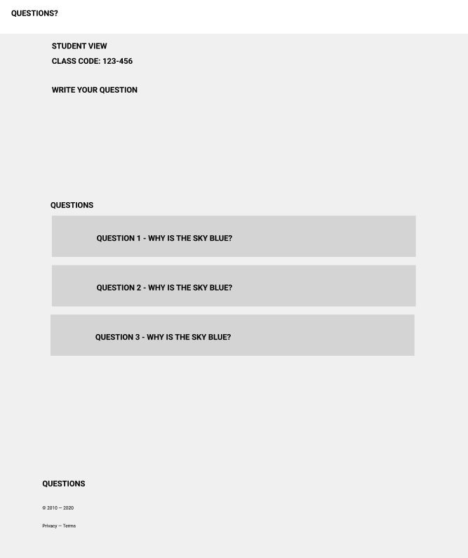

# Milestone 2

For the milestone, you're working with a new client to put together a prototype of a web application. Similar to the last milestone, we've been given a rough prototype in Figma as well as a list of User Stories that describe the functionality that the client wants to build.

Below is the high level description of the project that the client wants to build.

## Context

Our client is a teacher who works with high school + higher education students. One problem they routinely run into is answering questions for students, especially during class.

Its natural for students to have questions during class, but questions can come from a variety of places - whether thats students joining from Zoom or someone in the back of the room that would prefer not to speak up.

Its helpful to have one place to go to ask a question - where other students & the instructor can view the questions/comments that come up during class.

[View the Figma Wireframe here](https://www.figma.com/file/bZM4zszEbUQbfGa6Bz2X7U/CS-5356-Prototype-%232?node-id=77%3A432&t=lXqMcNeCvcJCluwV-1)

__Screenshot of one of the pages__

## Requirements & User Stories

The app will have 2 different kind of users, students and teachers. Each one will have access to slightly different functionality.

* As a student, I can ask a question (with my name or anonymously) for a particular class
* As a student, I can view questions being asked for a particular class session
* As a student, I can upvote or downvote a question
* As an instructor, I can view questions (and upvotes) that students are asking for a particular class session
* As an instructor, I can view who asked a particular question
* As an instructor, I can view my classes & class sessions
* As an instructor, I can create a class session

## Technical Details

This project is meant to be a prototype, and an exercise in figuring out your data model first before worrying about what tools you want to use.

* Users will only have usernames, no passwords. We'll store our user info in a cookie for the prototype.
* All the data can be stored in memory, we don't need to persist it. If the server restarts, we lose the data and that's fine for the prototype.

## Part 1 (3 pts) - Update Wireframes

The goal here is to identify what may be missing from the prototype, and help fill in the blanks.

Review the link to the wireframe in Figma. Then create a copy of the wireframe to make edits (you'll need to create a free Figma account first).

For every User Story, review the prototype and ask, "Do I have everything I need on the page in order to implement this feature?" If the answer is no, add the missing elements to your copy of the Figma wireframes.

Hint: There are 6 things missing/incomplete from the wireframe.

For your submission, include a viewable, shareable link to your copy of the wireframe in Figma.

## Part 2 (6 pts) - Build the API and connect the Frontend

Now that we've filled in the blanks and have a better understanding of the scope of the project, we can get started building it out.

This Milestone is split into 2 projects: a frontend application and our backend API.

For this Milestone, the focus of the project will be on the backend functionality. It is your job to implement our web API and our data model to support the application.

The majority of the HTML/CSS is provided for you, all thats left to do is take some input from the user, and send it to our backend API to save it.

Once you clone the repository for the Milestone 2 assignment, read the README.md first, and then search for `CS-5356-TODO` - this will show you all the spots around the code where you'll need to implement some functionality.

For your submission, include the link to your Feedback Pull Request. You should be passing your Autograding Github Check.

## Part 3 (3 pts) - Hosting

Once you've got your project working locally, it's time to get the prototype hosted using Firebase Hosting along with their Cloud Functions product.

TODO Add Guide to adding Cloud Functions (Danny will update)

Create some content on the site to generate some traffic (create classes, ask questions). We'll want screenshots to answer the following questions about your project
   1. How many API calls are made to your application? Hint: Some of the requests to your app are for HTML pages, others are to send/receive data.
   2. Create some traffic that results in a 401 Unauthorized Status Code, and then find it in logs
   3. What is the latency on one of the requests to post a question?

# Grading

Here's the breakdown of points. See the rubric in Canvas for more details.

* 3 pts - Update a wireframe to fill in missing details
* 6 pts - Send data from the browser, save it,
and display that data back to the user
* 3 pts - Hosting, Deployment, and Analyzing website traffic & performance

## Submission
This assignment will be submitted via Github Classroom & Canvas, so we can leave feedback on your code and you can leave your code private.

For your submission to Github Classroom, submit the link to your `Feedback` Pull Request containing the code for your project.

For your submission in Canvas, please submit a PDF with:

* a link to a shareable, publicly viewable link to your copy of the Figma Wireframes
* a link to your Feedback pull request in Github Classroom.
* Your public URL to your working website, something like https://your-project-id.web.app
* Screenshots of metrics and logs to answer the questions

# Accept the Github Classroom Assignment Link
https://classroom.github.com/a/_X8nkAuB