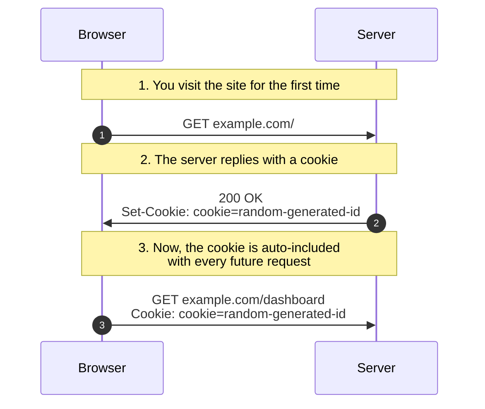
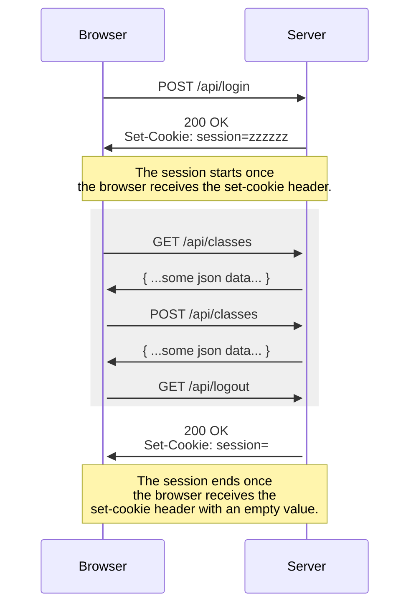
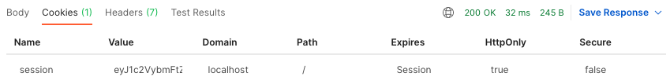

# Using Session Cookies For Login

One way to handle login functionality into your web app is by using cookies.

## What are Cookies?

A cookie is an HTTP header that is stored and managed by the browser, linked to your domain with a handful of security rules enforced by your browser.

At a high level, when you make a request to a website, that website can set a cookie in your browser. This happens all the time on the web, and its a common way to "track" users because cookies can stick around.

Let's say you have a website, hosted at www.example.com



Check out the MDN docs for more in-depth [details on Cookies](https://developer.mozilla.org/en-US/docs/Web/HTTP/Cookies)

## Implementing Cookies

### 1. Set the Cookie

Let's setup a server route `/login`, that expects a JSON body of `{ "username": "my-user" }`, and replies with a cookie containing that username.

```js
app.get("/login", (req, res) => {
  const username = req.body.username
  res.cookie('logged-in', 'username')
  res.send()
});
```

You can work with API requests & Cookies using Postman to get started. The examples below use `fetch()`, but use the example to fill in the request on Postman.

```js
fetch('http://localhost:8000/login', {
  method: 'POST',
  headers: {
    'Content-Type': 'application/json'
  },
  body: JSON.stringify({username: 'danny'})
})
```
* You should see in the response `Set-Cookie: logged-in=danny; Path/;`
* At this point, Postman will be managing your Cookie header.

### 2. Use the cookie

Let's add a /dashboard route that returns some html that displays your `logged-in` cookie value.

```js title=app.js
app.get("/dashboard", (req, res) => {
  const cookie = req.headers['cookie'].split(';').find(cookie => {
    const [key, value] = cookie.split('=')
    return key === 'logged-in'
  })
  res.send(`<html><body>${cookie}</body></html>`)
});
```
Then you made a request to /dashboard

```js
fetch('http://localhost:8000/dashboard')
```
You would see in the response

```html
<html>
<body>logged-in=danny</body>
</html>
```

That's because Postman included the cookie in your next request to `localhost:8000`. The browser behaves the same way.

At this point, this cookie will be attached to every request to your site until its explicitly cleared. That's pretty convenient.

This pattern is used for:
* __tracking__ - once you visit a website, the website can know when you've revisited. This is used in many popular analytics tools, like Google Analytics.
* __user preferences__ - if you enjoy dark mode in your browser, you can save the user's preferred light/dark mode in a cookie
* __cookie consent__ - one way of recording that a user has accepted a cookie consent form is by setting a cookie.

### Downside
Since the content of the cookie is in plain-text, anyone can send a request with a cookie if you know what the cookie header is supposed to contain, like the example below.

```js
fetch('http://localhost:8000/dashboard', {
  headers: {
    'Cookie': 'logged-in=danny'
  }
})
```
*Your browser won't let you send a `fetch()` request with a Cookie header, since it is reserved for use by your browser. So this only works in Postman or in Node.

## Using cookie-session with Express

[cookie-session is an NPM package](https://www.npmjs.com/package/cookie-session) to make it easier to work with cookies for user sessions in an Express application:
* It creates a cookie named `session` and it __encrypts/decrypts__ any data that you add to it.
* You can then read/write that cookie from any Express Route

### What is a Session?

It's helpful to define the word "session". A session is the period of time that we want to track - most commonly for logged-in user sessions. Here's an example for Milestone 2.



### Setup cookie-session & cookie-parser

This is already included as part of milestone-2, but here is what the setup looks like:

From the backend/ folder, run `npm install --save cookie-session`.
* cookie-session manages the user's session as a cookie
* cookie-parser makes it easy to work with cookies in express

Update `backend/app.js` to use cookie-session
```js title=backend/app.js
// highlight-start
import cookieSession from "cookie-session";
// highlight-end
...

const app = express();
// highlight-start
app.use(
  cookieSession({
    secret: "cookiesecret",
  })
);
// highlight-end
```

### Use cookie-session

__Start a session by adding something to `req.session`__. Let's use /api/login as an example:

```js
app.post("/api/login", (req, res) => {
  ...
  // highlight-next-line
  req.session.username = req.body.username;
  return res.status(200).send();
});
```
This route expects a body containing a username, and will then set that username in the user's session so we can identify them later on. `req.session.username` is all it takes to save a JSON object in a cookie.

If you make this request with Postman, you'll see this in the response:


:::info

In a real application, you would check the username & password, before adding some properties to the session to represent a logged in user. Since milestone-2 is a prototype, we're ignoring that part for now.

We'll get to use __real authentication__ for milestone 3.

:::

__Read from that session in any other route__. For example:

```js
app.get('/api/classes', (req, res) => {
  if (req.session.username) {
    console.log('username is present!')
  } else {
    console.log('user is not present!')
  }
  ...
})
```

:::caution

You need to check for a property in the session specifically, you can't do `if (req.session) { ... }`

`req.session` is a real object created by cookie-session that will be present in all requests.

However, the properties within `req.session` might not, i.e. `req.session.username` for example.

:::

__Destroy the user's session__: Check the [cookie-session docs](https://www.npmjs.com/package/cookie-session) to find out how to destroy a session.