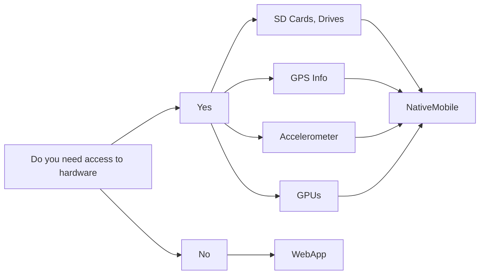
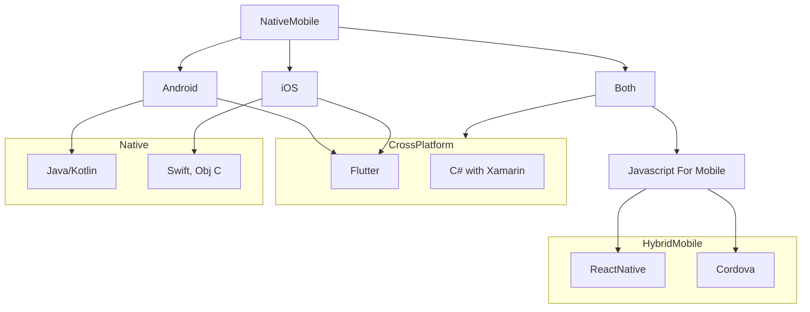
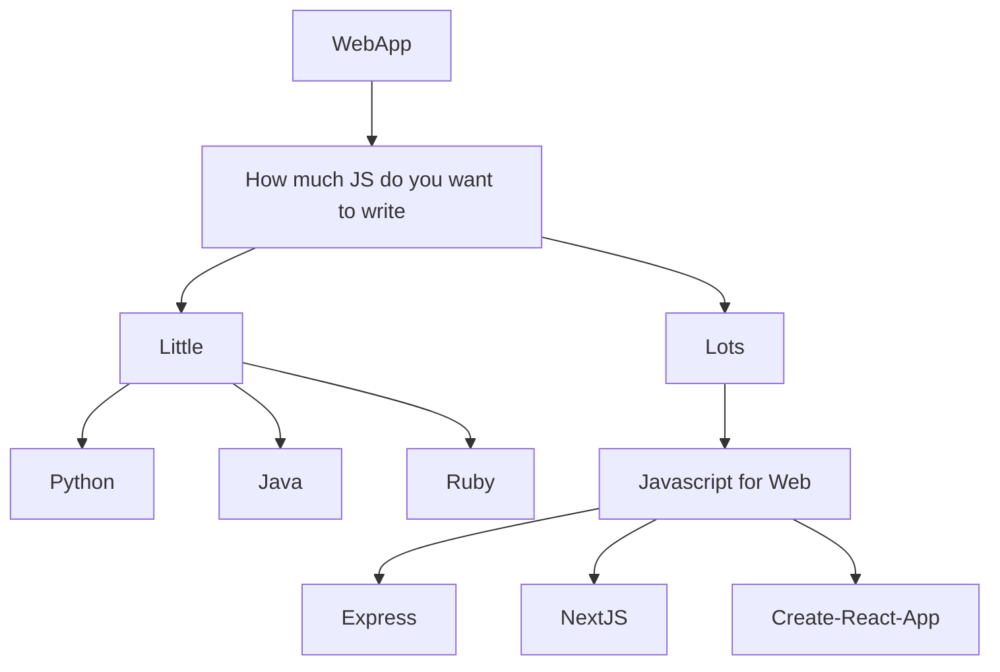
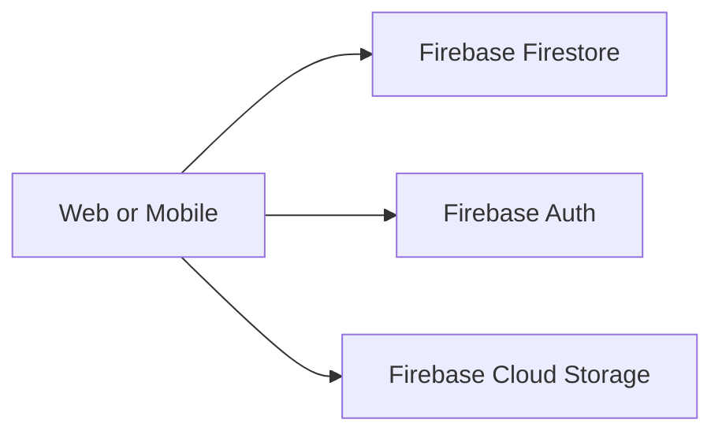
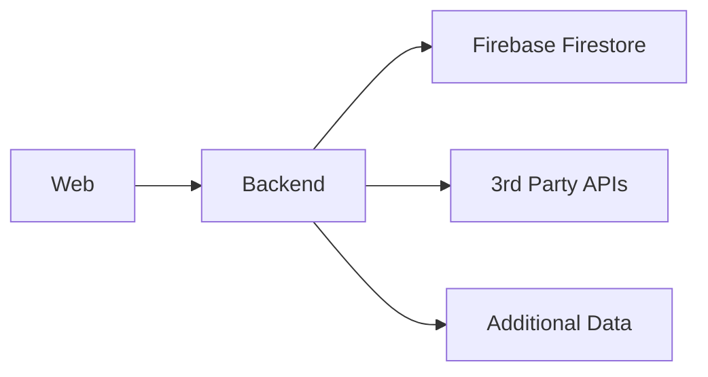
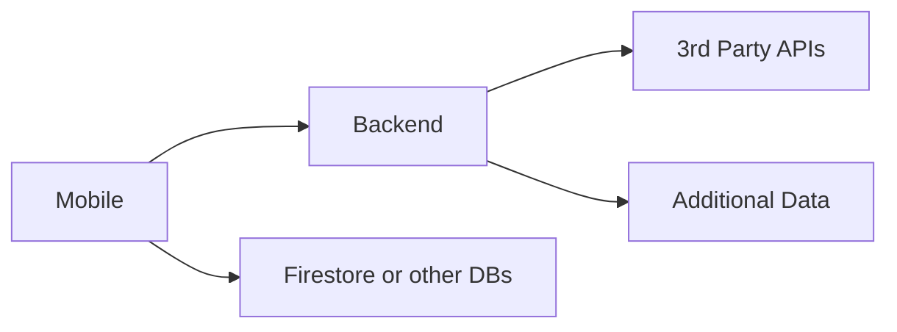
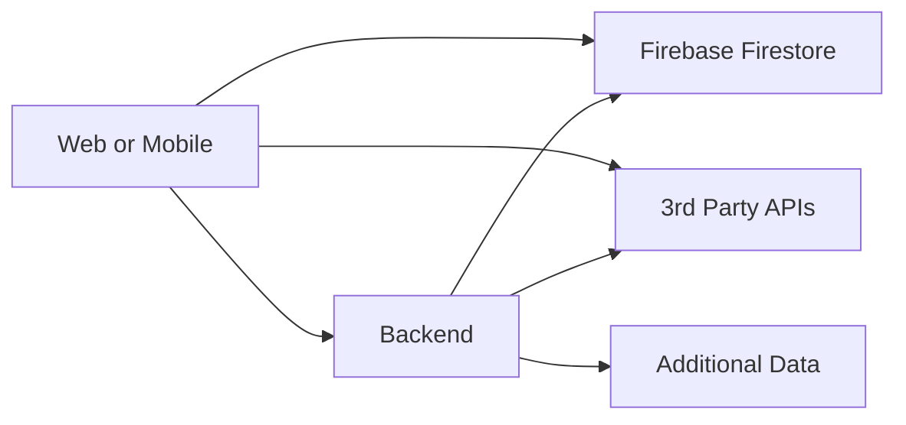

# Choosing a Tech Stack

# Choose a platform to build for

# Choose a language

## If you want to target Mobile

## If you want to target Web

# Choose an Architecture

## For simple needs

If you're ONLY going to be using Firebase Authentication & Firebase Firestore, you can usually cut out the need for a backend by relying on Firebase.

This makes it easy to get started if you feel comfortable working with tools like React on the Frontend.

There are some downsides:
* Releasing an update can take 12-24 hours over a large sample size
* No way of guaranteeing that someone updates to the latest version
* Not all 3rd party APIs support requests from the browser, but this works fine on Mobile
* Using API keys or other sensitive info from the Frontend is insecure
* Web and Mobile Apps cannot connect DIRECTLY to a database

## For more complex needs

Examples:
* If you need to integrate with a 3rd party API that requires an API key
* If you are aggregating data across multiple sources
* You need more control over the data used by your app

Tradeoffs:
* Setting up a backend is an additional app to manage
* You have to build your own security around your database or other 3rd Party APIs
* Updating the backend has immediate effects

## But dont do this

You have to make your calls to Firebase or other 3rd party APIs from 1 place, and not multiple places. This will be difficult to troubleshoot and manage!