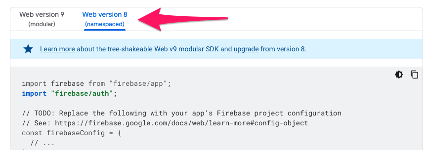

# Adding Firebase Auth

## Why use Firebase Authentication?

For Milestone 2 - we used cookie-based authentication with our backend server, but we didn't have to manage the user's password.

Rather than implementing a system for storing usernames & passwords, all of the functionality can be delegated to free or other 3rd party services.

Firebase lets you have upto 50k monthly users [for FREE](https://firebase.google.com/pricing). The only thing they charge you for is authentication [via Phone Number](https://firebase.google.com/docs/auth/web/phone-auth)


## Get Started

Follow this guide for adding Firebase Auth with a pre-built UI for your application.

For the purpose of this guide, you can use a new create-react-app to get login with Firebase working.

## Create React App

Run `npx create-react-app firebase-auth` to create a new React app for this exercise.

There's a few edits we have to make to get this working correctly with Firebase.

### Downgrade React

The pre-built Firebase UI isn't compatible yet with React 18 (the latest), so we need to downgrade to React 17.0.2 - make the edits below and re-run `npm install`

```json title=package.json
"dependencies": {
  // highlight-next-line
  // delete the @testing-library packages
  // highlight-next-line
  "react": "^16.14.0",
  // highlight-next-line
  "react-dom": "^16.14.0",
  // highlight-next-line
  "react-scripts": "^4.0.3",
  // highlight-next-line
  "react-error-overlay": "^6.0.9",
  "web-vitals": "^2.1.4"
}
```

### Update index.js

The last step is to make sure we're calling the right API from index.js

```js title="src/index.js"
import React from 'react';
// highlight-next-line
import ReactDOM from 'react-dom';
import './index.css';
import App from './App';
import reportWebVitals from './reportWebVitals';

// highlight-next-line
ReactDOM.render(<App />, document.getElementById('root'));

```
* Rename the `react-dom/client` import, to `react-dom`
* Use `ReactDOM.render` instead of `ReactDOM.createRoot`

:::info

Milestone 2 was built using create-react-app so everything you do here would apply to your Milestone 3 project, if you decide to use Milestone 2 as your base.

The only difference is that your Milestone 2 uses a backend via create-react-app's `proxy` property. [See more here](./../unit-2/frontend/developing-the-frontend.mdx#proxy-api)

:::

## Setup Firebase

Run `npm install --save react-firebaseui firebase`

The package we'll be using for this is called `react-firebaseui` from https://www.npmjs.com/package/react-firebaseui

### Update the App component

Import the following components at the top of your App.js

```js title="src/App.js"
// This uses the pre-built login form
import { StyledFirebaseAuth } from 'react-firebaseui';
// This imports firebase using the Firebase SDK v8 style
import firebase from 'firebase/compat/app'
// This imports the Firebase Auth libraries
import 'firebase/compat/auth'
```

:::info

Firebase made updates to their v9 SDK which changes the way you call their functions. You may see scattered documentation online that uses one style vs another.

V9 looks like:
```js
import { initalizeApp } from 'firebase'
initializeApp(config)
```

V8 looks like:
```js
import firebase from 'firebase/compat/app'
firebase.initializeApp(config)
```

The code we're using for this guide is their v8 SDK. See the [Firebase SDK Reference here](https://firebase.google.com/docs/reference/js/v8)

:::

To see more of the Firebase docs around Auth, look at their [Web > Get Started page](https://firebase.google.com/docs/auth/web/start#web-version-9_3). Make sure to refer to the `Web version 8 (namespaced)` code examples.



### Get your Firebase Details

1. You should have a Firebase project available to use - use either your M1 or M2 project.
2. Get your projects configuration by going to your Project Overview page, and clicking on Settings > Project Settings.
3. You can create a new Web App if it says you don't have an app yet.
4. Grab the sample config snippet to include in your app, it should look something like this

```js
// Configure Firebase.
const config = {
  apiKey: 'zzzzz',
  authDomain: 'zzzzz',
  // ...
};
firebase.initializeApp(config);
```
5. Paste this above your App component.

```js
// Configure Firebase.
const config = {
  apiKey: 'zzzzz',
  authDomain: 'zzzzz',
  // ...
};
firebase.initializeApp(config);

function App() {
  return (
    <div className="App">
    ...
```
## Add Firebase UI

1. Add your Firebase UI config - this tells react-firebaseui what you want to display and how

```js
const uiConfig = {
  signInFlow: 'popup',
  signInOptions: [
    firebase.auth.EmailAuthProvider.PROVIDER_ID
  ],
  callbacks: {
    // Avoid redirects after sign-in.
    signInSuccessWithAuthResult: () => false,
  },
};
```

2. Add state to your app to keep track of signed-in status

3. Add an `onAuthStateChanged` observer when the component loads for the first time via a `useEffect` hook

```js
function App() {
  // State to keep track of signed-in state
  // highlight-next-line
  const [isSignedIn, setIsSignedIn] = useState(false);
  ...
  useEffect(() => {
    const unregisterAuthObserver = firebase.auth().onAuthStateChanged(user => {
      // this gets called whenever a user signs in or out
      setIsSignedIn(!!user);
    });
    return () => unregisterAuthObserver(); // Make sure we un-register Firebase observers when the component unmounts.
  }, []);

```
4. Add the `StyledFirebaseAuth` component

```jsx
if (!isSignedIn) {
  return (
    <div>
      <h1>My App</h1>
      <p>Please sign-in:</p>
      <StyledFirebaseAuth uiConfig={uiConfig} firebaseAuth={firebase.auth()} />
    </div>
  );
}
return (
  <div>
    <h1>My App</h1>
    <p>Welcome - You are now signed-in - {isSignedIn}!</p>
  </div>
);
```

* Display the user's name & email address
* Add a button to sign the user out

Hint: See the [Firebase SDK Reference](https://firebase.google.com/docs/reference/js/v8/firebase.auth) to see everything you can do with the firebase.auth() object

### Login

You can now login. This pre-built form lets you register as a new user or sign in as an existing user. And you can see the info of everyone who logs in via your Firebase dashboard

### For Milestone 3

* How might you tweak your Milestone 2 App.js to work with Firebase Auth instead of?