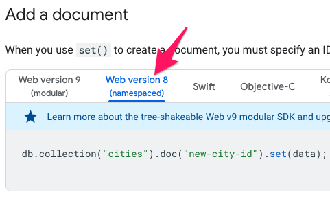

import Tabs from '@theme/Tabs';
import TabItem from '@theme/TabItem';

## Overview:

- Setup Firestore, and learn to read/write data from firestore.
- Analyze how many reads and writes are performed to calculate pricing
- Set up the emulator to prevent run-away reads and writes while learning

## Getting Setup

### Setup Firestore

- Use an existing project, or a create a new project. Using an existing one is fine for Firestore.
- Go to Build > Firestore and click Create database


- Select “Start in test mode”. We’ll revisit security rules later.
- You can choose the default Firestore location and click Enable
    - You could get a faster connection to Firestore if its location is closer to your users
    - You may have legal/compliance reasons to keep data within a certain country

### Visit the CodeSandbox

I’m trying out CodeSandbox as a way of sharing out React apps without having to worry about your local environment.

Visit the [react-firebaseui-template in CodeSandbox](https://codesandbox.io/s/react-firebaseui-template-ggrd34)

This template contains a minimal example with working versions of react & firebase. All the normal VSCode shortcuts work within CodeSandbox.

`App.js` contains all the code, pretty much straight from the [README for the project here](https://github.com/firebase/firebaseui-web-react#using-styledfirebaseauth-with-local-state)

`PostsList.js` contains the React component for the Post widget we’ve been doing a few times in class.

`database.js` is a file containing the methods you need to implement to make `PostsList.js` work correctly.

For this exercise, you’ll be editing `database.js` and using the app to make sure things are working.

### Get your Firebase Config Information

After you initialize Firestore, grab your Firebase Config object and paste it into `database.js`

It looks like this:

```
const config = {
  apiKey: "...",
  authDomain: "...",
  projectId: "...",
  storageBucket: "...",
  messagingSenderId: "...",
  appId: "..."
};
```

If you don’t have this yet, you’ll need to “Create a new web app” on Firebase. Go to your Project Settings and create an app


## Using Firestore

Go to `database.js` and read through the TO-DOs. Note - all the exercises are based on making edits in that file. If you wind up using different names for your properties, they also need to be updated in `App.js`

The purpose of the exercise is to get you familiar with the API for reading and writing data to Firestore, along with some of its limitations as well.

When you’re looking at the docs for some of the APIs below, make sure you’re looking at the `Web version 8` docs



### Using Promises with Firestore

The whole Firestore API uses Promises, so you'll see `.then((...) => { ... })` in a lot of the code snippets. When working with Firestore, its easier to read and write if you use `async/await` syntax. For example:

__Without a return value__

<Tabs>
<TabItem value="Promises">

```js
// Add a new document in collection "cities"
db.collection("cities").doc("LA").set({
    name: "Los Angeles",
    state: "CA",
    country: "USA"
})
.then(() => {
    console.log("Document successfully written!");
})
.catch((error) => {
    console.error("Error writing document: ", error);
});
```
</TabItem>
<TabItem value="async/await">

```js
try {
  // Add a new document in collection "cities"
  await db.collection("cities").doc("LA").set({
      name: "Los Angeles",
      state: "CA",
      country: "USA"
  })
  console.log('Document successfully written')
} catch (err) {
  console.error("Error writing document: ", err);
}
```
</TabItem>
</Tabs>

__With a return value__

<Tabs>
<TabItem value="Promises">

```js
db.collection("cities").doc("SF").get().then((doc) => {
  if (doc.exists) {
      console.log("Document data:", doc.data());
  } else {
      // doc.data() will be undefined in this case
      console.log("No such document!");
  }
}).catch((error) => {
    console.log("Error getting document:", error);
});
```
</TabItem>
<TabItem value="async/await">

```js
try {
  const doc = await db.collection("cities").doc("SF").get()
  if (doc.exists) {
    console.log("Document data:", doc.data());
  } else {
    // doc.data() will be undefined in this case
    console.log("No such document!");
  }
} catch (err) {
  console.error("Error getting document: ", err);
}
```
</TabItem>
</Tabs>


### #1 Create some data

`PostsList.js` has a form with a username field, a name field, and a message field. The form has an `onSubmit` handler that will take that data and save it.

Update `database.createPost(...)` to take those 3 parameters and save it in Firestore.

At this point, you should be able to see your new data in the Firebase console

See [“Add a document”](https://firebase.google.com/docs/firestore/manage-data/add-data)

Notes:

- If you want to use your own IDs, you can use `.doc('some-id').set({ myData: ...})`
- If you want to let Firebase create IDs for you, use `.add({ myData: ...})`
- Sequential IDs can cause performance issues when using Firebase. Behind the scenes, all your data is distributed among a large fleet of servers, based on your ID. If your IDs are sequential, the data will be closer together and may wind up on the same server, causing slow downs. Random UUIDs can distribute your data amongst the servers evenly, resulting in fast reads. [More info here](https://firebase.google.com/docs/firestore/best-practices)

### #2 Get data out

Once the data has been updated in Firestore, `PostsList.js` is configured to get the latest data, and display it.

Update `database.getAllPosts()` to get all the posts that have been saved in Firestore

See [“Get a document”](https://firebase.google.com/docs/firestore/query-data/get-data) or [“Get all documents in a collection”](https://firebase.google.com/docs/firestore/query-data/get-data#get_all_documents_in_a_collection)

Notes:

- In the docs, `db.collection('...').get()` returns a `querySnapshot`. `querySnapshot` is an object that contains a `forEach` method to get every document in your collection.
- Unfortunately, the ONLY way to get your data out is to use `.forEach` , and push all the items to a new array.
- Every item in `querySnapshot` is a `doc` object. `doc` contains `[doc.id](http://doc.id)` and `doc.data()`.
- `doc.id` is the autogenerated ID that Firebase uses
- `doc.data()` (note the parens) is the object containing all the data that you added
- If you want to create an object that contains BOTH the id and the data, you’ll have to combine them: `const data = { id: doc.id, ...doc.data() }`

### #3 Delete the data

You can delete anything that you’ve added as long as you have the ID for that data.

Update `database.deletePost(...)` to delete a post with a particular ID. Make sure your `post` in `database.getAllPosts` has a `post.id` property.

See [“delete documents”](https://firebase.google.com/docs/firestore/manage-data/delete-data)

### #4 Update some data

We can update our post data with a `likes` counter.

Update `database.likePost(...)` to update a post with a specific ID, and increment the `likes` property.

There are 2 ways you can do this:

1. Increment the value, and then update the post to set `likes` to the new value
    1. This can be problematic. Imagine this scenario
        1. A post has 1 like
        2. 2 people load the page, and both hit the Like button for the same post
        3. The post now has 2 likes (and not 3).
2. Tell firebase to increment a number by 1.

See [“Increment a numeric value”](https://firebase.google.com/docs/firestore/manage-data/add-data#increment_a_numeric_value)

Notes:

- If you’re working with arrays, see [Update elements in an array](https://firebase.google.com/docs/firestore/manage-data/add-data#update_elements_in_an_array)
- Or [Update fields in nested objects](https://firebase.google.com/docs/firestore/manage-data/add-data#update_fields_in_nested_objects)

### #5 Add Firebase Auth User Info

One pattern of creating data in Firebase is to attach a userId property to your data, so you can filter on it later. You can also use the name & email from your Firebase Auth info.

Update `onSubmit` in `PostsList.js` and:

- add a `userId` property
- update the `username` to use the email from your Firebase user
- update the `name` to use the display name from your Firebase user

See “[Get a user’s profile](https://firebase.google.com/docs/auth/web/manage-users#get_a_users_profile)” to see what data you can get

### #6 Get all your own posts

If you sign out and back in a new user, you can see all the posts created by the previous user. Let’s say we want to update the functionality so that a user should just be able to see their own posts.

Update `database.getAllPosts()` to get all the posts where the userId is set to your current user’s ID.

See [“Simple queries”](https://firebase.google.com/docs/firestore/query-data/queries#simple_queries)

## Challenges

- How might you search for posts from another user?

Hint: You’ll have to find a way to keep track of other users and their ID or their name.

- How would you search for text across all messages? For example - search for all posts containing “John Wick”

Hint: The only query operators you have available to you [are these](https://firebase.google.com/docs/firestore/query-data/queries#simple_queries).