# How do you know if it's working?

We've used a number of different services to build, test, deploy your application. Sometimes you can do it all in your frontend application. Sometimes you need to send data back and forth to your backend. Sometimes you'll be using a third-party backend.

The more complex your application, the harder it becomes to answer "Is it working?"

So how do you know if it's working? Well, the easy answer is "It depends."

## Observability

Observability is a concept that has really become popular in the last couple of years with the rise of cloud computing.

At its core, Observability refers to your ability to proactively find answers to questions about everything from your business to your infrastructure. Your ability to do that is based on having access to 3 types of data - Metrics, Traces, and Logs.

If you have all 3 types of data, you should be able to answer most questions about your business and technology.

**Metrics**

Metrics usually refers to numeric data. For example, the number of requests per second processed by your backend, or the load time of a web page.

**Logs**

Logs refers to logs for your frontend/backend and any system you're operating.

- In the browser, your logs are in the Chrome Developer Tools > Console.
- In the local environment of your backend project, your logs print to the screen
- In the production environment of your backend project, your logs will be available in the Firebase Cloud Logging dashboard.

**Traces**

Traces refers to the ability to trace your data as it goes through your system. In your project, your browser makes a request to your backend which makes another request to your database, which behind the scenes makes even more requests to other internal AWS services.

It used to be that access to this data usually required a pretty penny. Nowadays, there's third-party services like NewRelic, Datadog that give you a decent free tier, but they start charging you hard as soon as your traffic exceeds "hobby" project traffic.

At scale, the sheer volume of data that you can accumulate from every system means that you might be storing TBs of data per day. Not only do you have to store it, you also need to be able to search across tens or hundreds of TB of data as well create charts and dashboards out of it.

## What information might you want to know?
Useful things that you might want to be aware of:
- is anyone signing up
- how many people are posting
- how much is this costing me
- how many requests are coming in
- how many users do I have

These questions can fall into a couple of different categories

**1. Business**

Are you making money? If you're Amazon - you make money when you process payment for an order. So you'd want to keep an eye on all the systems responsible for processing payments. Any downtime directly costs you money. If you want a fun read, check out the story of [Knight Capital with a $440 million bug](https://www.henricodolfing.com/2019/06/project-failure-case-study-knight-capital.html).

**2. Product**

Are users clicking the "Buy Now" button? Are users clicking the "Place Order" button? Also, does the "Place Order" button work right now?

Hopefully, your tests have proven that the button works before you pushed your changes to production. But there are some errors that you'll only see in production.

You'd want to track how many users are clicking this button from your browser which you can track with something like Google Analytics, and you might be able to tell from server logs whether the payment actually processed.

There is a category of tools called "Business Intelligence" tools like Looker or Tableau that specialize in storing and displaying this type of data for business-level insights.

**3. Application**

Is the page loading so it can show the "Buy Now" button? Is the page loading fast or slow?

You can track load times from the perspective of the user using tools like Google Analytics. You wouldn't want the product page to be slow because it might mean that a user won't click the "Buy Now" button.

You can also track response times from your backend service that processes the purchase to make sure this is happening fast enough.

**4. Infrastructure**

Are your web servers serving your application to your users? Do your backends have a valid network connection? Maybe they can't even access it.

You'd want to track the performance of your web server to make sure its serving your assets (HTML/CSS/JS/images) fast enough.

Firebase deploys to a worldwide CDN for you with a generous free tier. A CDN is a globally distributed cache that can get your frontend code closer to your users so that they can get to it faster. You'd want to monitor both of these systems to make sure that they are correctly serving data to your application.

**5. Hardware**

If your backend is built on AWS Lambda, do your functions have enough memory to run?

If you're running virtual machines or "bare metal", are they large enough for your use case? You can usually tweak things like CPU, Memory, Network traffic, and Disk traffic.

## What kind of data can you see?

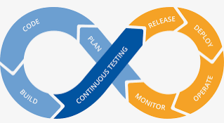

Each stage in your software lifecycle can generate its own metrics, traces, and logs.
Each environment you have will create its own metrics, traces, and logs.
Each piece of software will generate its own metrics, traces, and logs.

If you're Netflix, this creates a massive problem.

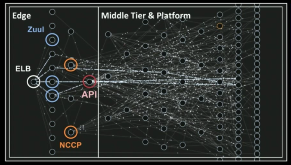

[From Mastering Chaos - A Netflix Guide to Microservices](https://www.youtube.com/watch?v=CZ3wIuvmHeM)

If this sounds like a lot of data, then yes, it is a lot of data. You can split data into various layers, here's one way of splitting it

### Product-level monitoring

Tools like Google Analytics and MixPanel give you a high-level "product" view of your website. You can see things like:

**Users, Sessions, and Bounce Rates**

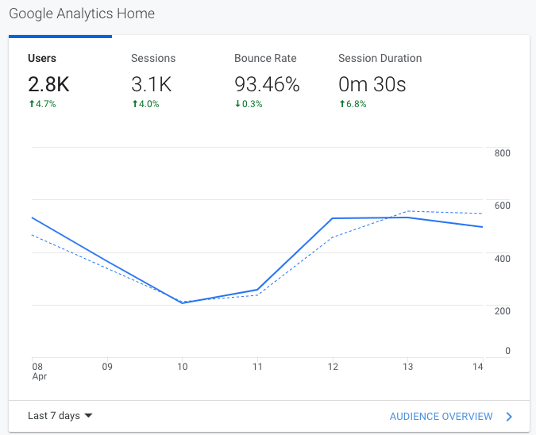

Users are considered unique visitors to your site usually by either IP address, or other cookie tracking techniques.

Sessions are considered the period of time when a user is navigating your website and maybe seeing multiple pages

Bounce Rates is the percentage of people who leave your page after 1 view. This screenshot has a high bounce rate, meaning 93% of people read one article and leave.

**Where are your users coming from?**

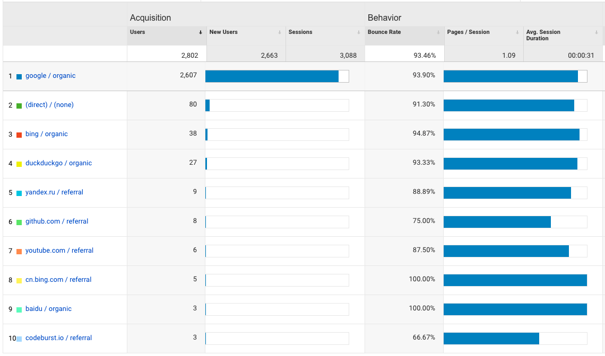

These analytics tools can help capture some really useful data - like how did your users arrive at your page? In this screenshot of my blog - most of my users find me via Google search. But the ones that find me from Github and Codeburst.io tend to linger around for longer on my site.

**What did users search for to find you?**

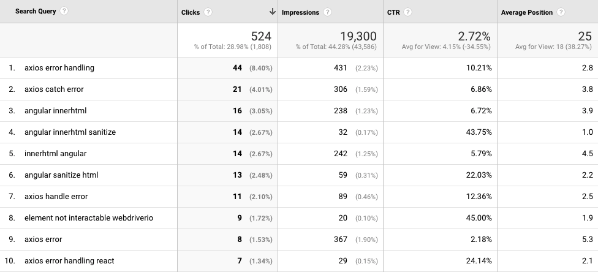

Here, you can see what search terms were used that resulted in clicks on my page. There are a handful of keywords where I rank at the top of the search results - "axios error handling", "angular innerhtml sanitize", and "element not interactable webdriverio".

**How did your users use your site?**

Google Analytics offers "Behavior Flow" which gives you a visual description of what users did your site. For everyone that visits my top ranking page, some of them will read my other articles. Thats usually because there's a "If you liked this article, read another related one here!"

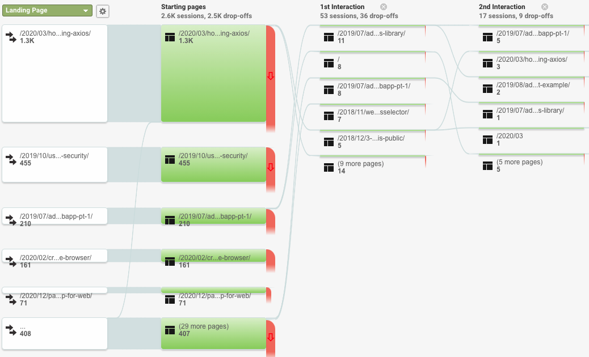

### Frontend Web Application Monitoring

#### Monitoring your app locally

At the center of any software is a CPU thats doing the work, and some RAM that's storing some memory.

- When a website eats a lot of CPU - it turns your laptops fan into 747 leaving JFK
- When a website eats a lot of memory - the page gets slower to use, and then your computer also gets slower as Chrome wants more memory.

You can see this data in Chrome by going to Chrome Dev Tools > Performance Monitor to see the real time stats from your page.

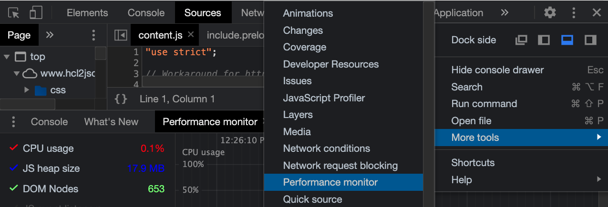

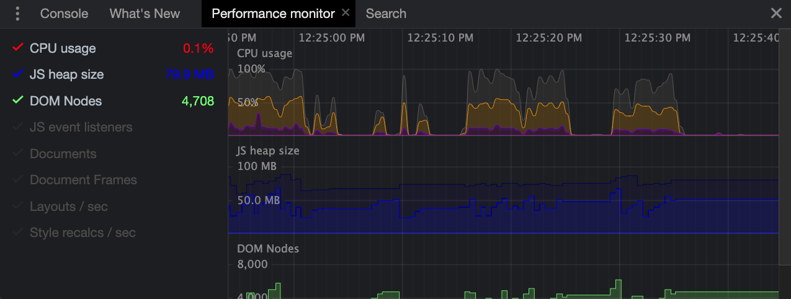

At the center of any website or web project is the network thats transferring data in and out of the internet. When a website eats a lot of data - its usually pretty slow. Also it'll eat your bandwidth limits if you're using your phone.

The Network tab in Chrome Dev Tools has a bunch of the data you'll want to keep an eye on.

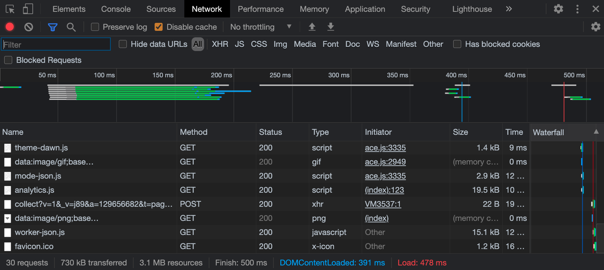

Here, you can see the # of requests you made, how much data was transferred both for each request and as a whole, and how long it took to finish loading the page.

To reduce these things:

- CPU and Memory - Its easy to make mistakes, and sometimes you'll accidentally introduce a memory leak that eventually crashes the page. Monitoring the Performance Monitor is a good sense to see how your application is behaving.
    - For very interactive websites with dynamic data loading from different sources - you'll typically hit limits on the network before you hit limits on CPU & Memory. Frameworks like React/Vue are designed to make it harder to write bad websites.
- For websites with a lot of content (Instagram) - you have to make some optimizations:
    - You can load the page and its resources faster if you use a CDN which Firebase already uses
    - Web content can be gzip'd by the web server - a compression algorithm supported by browsers. Take a look at how it works with this [visualization by Julia Evans](http://jvns.ca/blog/2013/10/24/day-16-gzip-plus-poetry-equals-awesome/)
    - The browser has its own internal cache where it can cache images & fonts & css based on Cache-Control headers provided by the web server
    - Images can be resized on demand with lower resolution for display on mobile vs desktop devices.
    - Making fewer large requests is faster than making lots of little requests - there's an overhead to making a network connection to another domain and the browser controls how many concurrent requests your page makes at once

- If you want to know how to improve your page overall - check out Lighthouse in Chrome Dev Tools. Its designed to run some tests on your website, give you a score for how well its made, and give you tips to improve some of those scores.

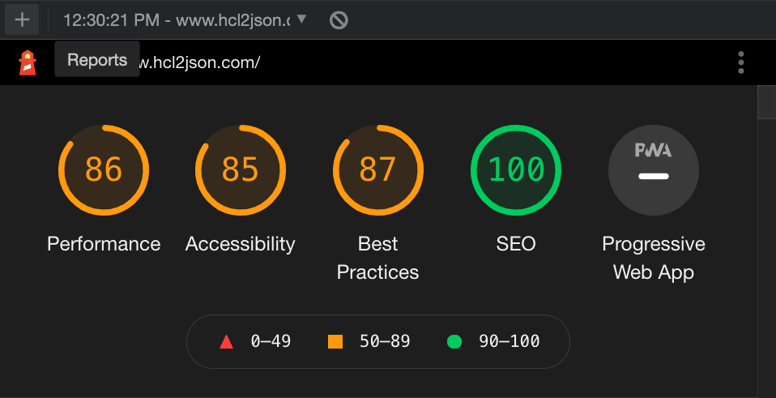

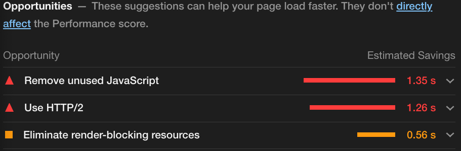

#### Monitoring your frontend app in production

You can keep an eye on your frontend in production by taking a look at the Firebase Cloud Logging dashboard for your Firebase Hosting project. You can get there by selecting `Build > Hosting > Usage tab > View web request logs with Cloud Logging`

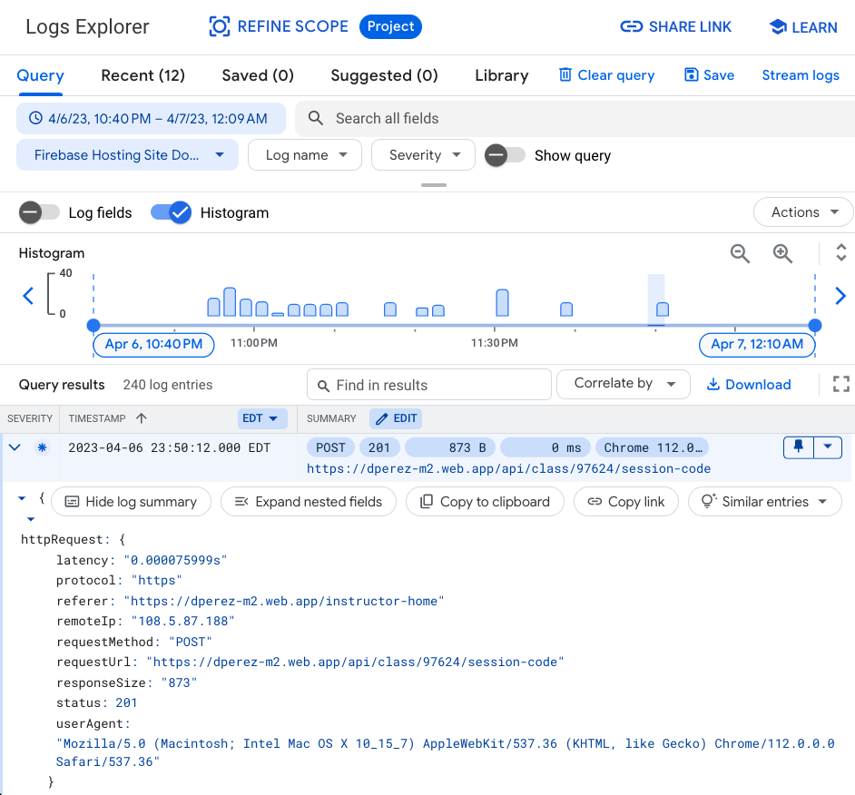
Here you'll get a useful graph that displays all the requests that your application received.

You can see things like what URL was accessed, what status code it came back with, and the User Agent - which means what tool did you use to access the page. In this example, the user agent is a string that looks something like

`Mozilla/5.0 (Windows NT 10.0; Win64; x64) AppleWebKit/537.36 (KHTML, like Gecko) Chrome/90.0.4430.72 Safari/537.36`

Most real browsers have a user agent that looks something similar to that. You can visit https://www.whatsmyua.info/ to see what user agent your browser is reporting.

However, every once in awhile, you might see fishy user agents from online crawlers like this:

`Expanse%20a%20Palo%20Alto%20Networks%20company%20searches%20across%20the%20global%20IPv4%20space%20multiple%20times%20per%20day%20to%20identify%20customers&%2339;%20presences%20on%20the%20Internet.%20If%20you%20would%20like%20to%20be%20excluded%20from%20our%20scans%20please%20send%20IP%20addresses/domains%20to:%20scaninfo@paloaltonetworks.com` which is a URL encoded string that says...

`Expanse a Palo Alto Networks company searches across the global IPv4 space multiple times per day to identify customers' presences on the Internet. If you would like to be excluded from our scans please send IP addresses/domains to: [scaninfo@paloaltonetworks.com](mailto:scaninfo@paloaltonetworks.com)`

### Backend API Monitoring

If you wind up hosting your frontend and your backend together, like you did for Milestone 2, you can view the access logs for your API in the same place as your frontend.

But if you want to see things like console.log statements you're making on the backend after you deploy, you can find those in your Cloud Functions logs. You can get here by going to `Build > Functions > Click on the 3 dots next to your deployed function > Click View Logs`

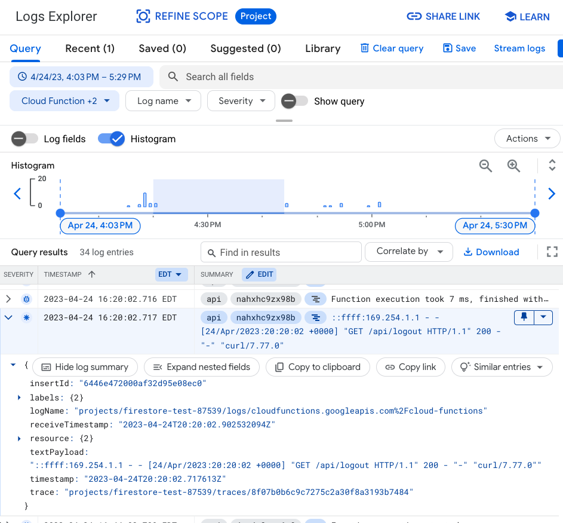

### Database Monitoring

No matter which database technology you're using, you'll have to monitor how your database is performing. An incorrectly written query can cause your database to start dragging.

If you design your data to make it easy to query from your database, you can use Firestore for VERY cheap, even with a lot of traffic.

How do you know how much you need? You can do some "back of the napkin" math.

If when you load the page, you only make 1 request for one document in a collection to display some social media posts. You've made 1 read.

If when you load the page, you see the last 100 social media posts, you've made 100 reads.

If you have 1000 users each loading the last 100 social media posts every second, you're making 1000 * 100 = 100,000 reads per second. At this rate, you'd need to optimize your usage or you'll start to pay significantly more for your Firestore usage.

### Cost Monitoring

Last but not least, you have to know where your money is going!

In this world where you only pay for what you use, you might wind up using a lot. Much like the all-you-can-eat buffet, you might be overdoing it. How do you find out?

Go to your Firebase console, select your Project Settings icon, and you can view your overall Firebase usage, relative to their pricing tiers.

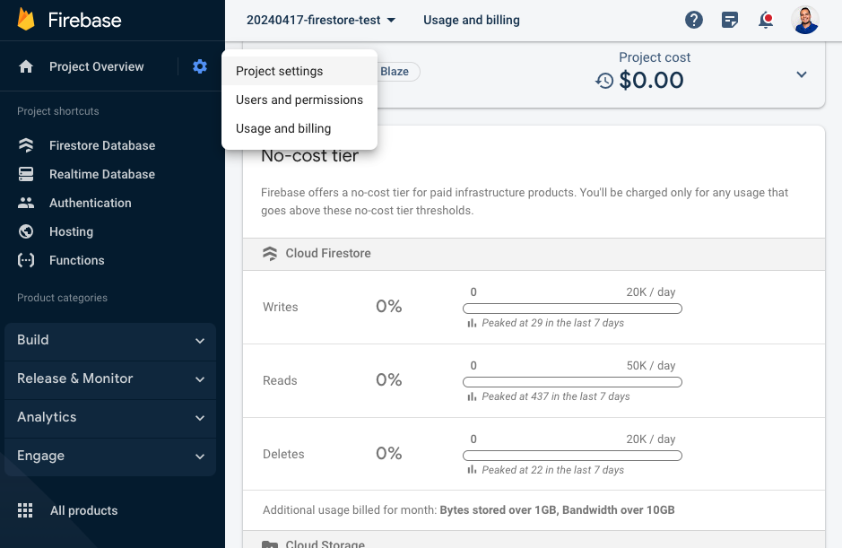

From this page, you can also configure a budget and have Firebase alert you when you get close to a certain spend limit. For most hobby and early startup projects, you can get pretty far with their free tier.
