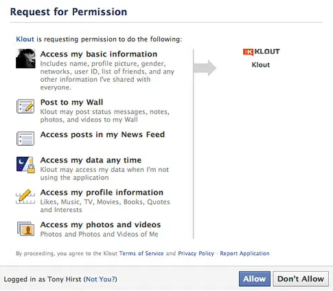
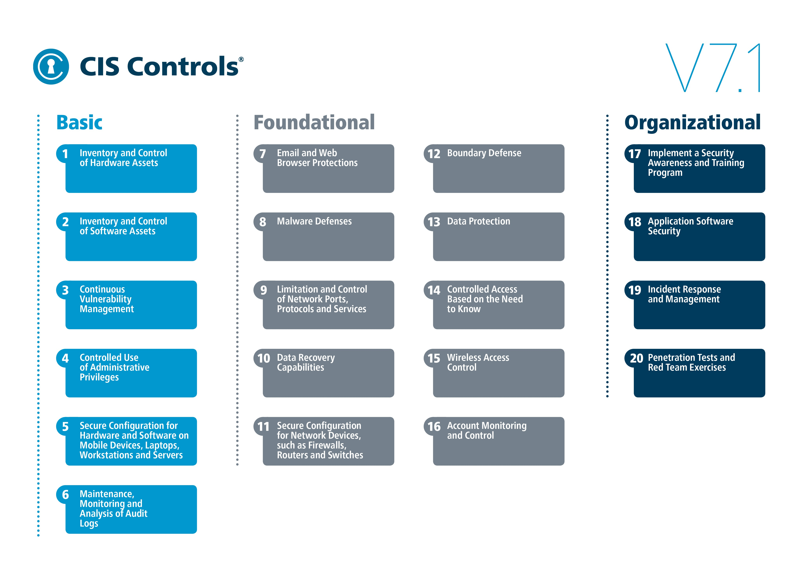

# Securing your data and your software

tl;dr Don't store passwords, social security numbers, financial info, health information, or identifying info of children < 13 years old. Some people tend to steal it, and other people tend to get upset when when this is made public.

## Information Security

In order to talk about security in a practical sense, you have to be able to answer the question - what are you securing?

Usually, this is data - particular bits of data that are useful to you.

- If you're working on a chat app, you have user names & messages.
- If you're working on a food delivery app, you have peoples orders & payment information (maybe).
- If you're working on a social media app, you have people's personal info, messages, and a list of their contacts.

If your apps or features are designed to be public, like a social media feed, then there's less to secure - all the data is already public. But what if you have a private group or a private chat - then it becomes problematic if some of that info becomes public.

That said, public information still poses a liability to your business as it can be misused or abused.

**Facebook and Cambridge-Analytica**

[Read the full summary here](https://en.wikipedia.org/wiki/Facebook%E2%80%93Cambridge_Analytica_data_scandal)

Cambridge-Analytica had data scientists create an app on Facebook called "thisisyourdigitallife" that had people answer questions on a survey, and it would build a personality profile. Facebook apps had access to the same data as the user that installed them, which meant it was able to collect your data and the data of anyone in your network. This meant they were able to amass a giant database containing personality traits and profiles of millions and millions of people.

This became a scandal when an ex-employee went public with what the company was doing,  that they had worked on the Brexit campaigns and the 2016 election, and that they were responsible for helping Trump get elected. All the personality profiles of millions of people were exploited to provide extremely-targeted political advertisements meant to influence your vote. Whether or not their strategy actually influenced the election is up for debate.

Did they do anything wrong? Not really. Thats just the way Facebook worked at the time. You, as a Facebook app developer, would publish your app, and users would install the app and agree to give your app permissions to see your network and all their data. All they did was collect the information you agreed to provide.

**On Privacy**

Ever since, more and more companies have started to care more about privacy and how much data about users you make public. Facebook tightened up their terms of service, privacy policy, app permissions. Android and iOS started placing more emphasis on showing what permissions an app may be requesting so that the consumer would be aware of their data may be used.

Even governments have started to get involved in the form of regulation, and the EU led the way by passing the General Data Protection Regulation (GDPR) which took effect on May 25 2018.

**GDPR and how it affects technology companies**

Even though GDPR is a law that was passed in the EU, it applies to the data of any EU citizen and any business that stores or processes their data is subject to the rules.

At a high level, it asks businesses:

- Store only the info you need, and protect any Personally Identifiable Information (PII)
- Give people the right to request their data, and to be forgotten (have all your data deleted).
- Get consent to communicate with users for marketing purposes

You've probably seen these cookie consent popups on websites all over the world

Organizations that don't comply will face penalties from the EU.

This has some consequences for developers building systems. If you intend to store any amount of sensitive information, you are responsible for securing it, and if you leak it and it causes problems, you might face a hefty fine from the EU.

The risk is relative to the sensitivity of the data that you're storing.

### What kind of data is sensitive data?

- Personally Identifiable Information
- Personal Health Information
- Financial Information
- All of the above especially for children < 13.

**Personally Identifiable Information**

Any data that can be used to uniquely identify a person - names, addresses, phone numbers.

GDPR was made to force companies to protect this type of data. [Read more about GDPR](https://medium.com/ft-product-technology/a-developers-guide-to-gdpr-that-won-t-make-you-sweat-4f1f7f1d9c8b)

**Personal Health Information**

Any medical data like important dates, medical records, health plan information, or other health information.

If you plan on using this data on behalf of a doctor/clinic or other health organizations - the Health Insurance Portability and Accountability Act (HIPAA) was passed in the US to create standards for protecting this type of data. [Read more about PHI & HIPAA](https://www.truevault.com/blog/protected-health-information.html)

If you don't plan on sharing any of that data, you do not need to be HIPAA compliant.

**Financial Information**

Data like credit card & bank account numbers.

If you're processing payments with a financial institution (like processing a credit card swipe), part of the terms of service with the provider is that you need to comply with the Payment Card Industry Data Security Standard (PCI-DSS). Any data breach can make you responsible for any fraud that gets committed as a result.

**Data from children < 13**

Any PII about young children.

If you store any personal data from children, you're bound by the Children's Online Privacy Protection Act (COPPA). The FTC can issue fines starting at $16k per violation. [Read more about COPPA](https://www.websitepolicies.com/blog/coppa-guide).

By now, you've hopefully realized that collecting certain types of data comes with rules & regulations that come with consequences if the data is not protected correctly.

### How do you protect sensitive data?

While all the laws surrounding sensitive data may sound scary and overwhelming, its not THAT bad to implement some of these requirements. At a high level, they all want the same thing - for you not to be at the center of a data leak, at least not out of negligence.

There is an organization called the Center for Internet Security that provides guidelines for ways to protect your infrastructure and your data. This is as close to an answer as you'll get for "How do you do security?"

These guidelines are helpful regardless of what kind of data you are storing. And if you're starting from 0 security experience, you can feel confident that you're starting in the right place.

There's a lot of overlap with GDPR, HIPAA, and PCI-DSS compliance standards and the CIS controls list. If you do or can do most things on their Basic list, you're well on your way to having a baseline of security practices that will only improve as your technology and business mature.

**So how do you as a web developer get started on implementing some of these controls?**

If you're using a public cloud provider like AWS, GCP, Azure, as part of their terms of service, you agree to their Shared Responsibility Model, which outlines what AWS is responsible for, and what you as a user of AWS is responsible for. All the cloud providers have something similar in place, and here's an example from AWS.

If you're building on top of one of these cloud providers, they offer you tools and resources to help you implement common CIS controls as well as meeting various compliance standards.

- AWS has GovCloud - An entire cloud infrastructure devoted to meeting various government regulations for managing confidential and top secret data. The Pentagon isn't going to be putting any of their data next to yours
- Every year, more AWS services meet compliance standardis for HIPAA & PCI-DSS so that you can use more cloud services for managing and processing sensitive data.

**So what services are available to you?**

1. Inventory of Hardware Assets
    - if you're using a cloud provider, you likely don't have much hardware apart from your workstation and your phone ✅
    - You might be using a long laundry list of AWS services though and you should know what they are. One way of seeing this information is by taking a look at your AWS bill - it will outline where you're spending money.
2. Inventory of Software Assets
    - Each application you deploy to the cloud needs to be managed. So far, we've deployed a frontend application via AWS Amplify & a backend application via API Gateway + Lambda. using Serverless framework.
    - As you deploy more applications, you'll need to remember what it is that you're deploying. At scale, companies might build tools to display a catalog of services & applications and who is responsible for what.
    - AWS also offers Service Catalog to help you build a list of applications that are deployed to your account
3. Continuous Vulnerability Management
    - You should know where your weaknesses are in your applications before others do
    - AWS has a whole suite of tools
        - Inspector - run vulnerability scans on your virtual machines
        - GuardDuty - monitor suspicious traffic coming in and out of your network
        - Web Application Firewall - protect your web applications with a firewall to prevent DDoS and other potentially malicious attacks
        - Macie - scan your S3 buckets for sensitive data
    - You can also use open-source versions of these same tools
        - BurpSuite & Zap are two popular proxy scanners. They record the traffic going in and out of a website and alert you to funny activity
        - skipfish is a tool to run scans against your application to identify vulnerabilities
        - Mozilla's Observatory can scan your website and give you a grade depending on what it finds
4. Controlled Use of Admin Privileges
    - Do you know who is doing what in your account?
    - AWS offers
        - Config - keep track of changes to all AWS services so you know who changed what and when
        - CloudTrail - an audit log of any action taken in your AWS account along with what was done
        - IAM - a set of tools to provide restricted access to AWS services
5. Secure configuration for hardware and software on user devices
    - If you have multiple people using an AWS account - how do you know that they are protecting themselves correctly?
    - As you grow a team that has access to AWS, they'll have access keys and a potential leak of those access keys means that you're footing the bill.
    - At established companies, they'll require things like:
        - Full-Disk Encryption with strong passwords so that if you lose your device, someone else won't be able to easily access the data on your device
        - Multi-Factor authentication into the AWS console
        - Remote administration of workstations so if you lose your device, your IT department can remotely wipe the data on the device.
6. Maintenance, monitoring, and analysis of audit logs
    - While the CIS guidelines call out audit logs specifically, all logs generated by your application need monitoring. Backend logs from your lambda function, frontend access logs, CloudTrail audit logs - all of it needs regular monitoring to see if there's funny activity coming to your application
    - Here's what you might wind up [seeing your production logs](https://www.intricatecloud.io/2018/12/3-things-you-might-see-in-your-logs-once-your-site-is-public/)

Depending on what your system architecture looks like, accomplishing this can be either easy or hard. Its usually easy if you're all in on a cloud provider, and its the hardest if you have a mix of clouds or a hybrid data-center/cloud infrastructure.

## How can you proactively protect your data?

As developers, we'll spend the majority of our time writing code, and we might accidentally introduce vulnerabilities. But what are the vulnerabilities and attacks we need to watch out for?

The Open Web Application Security Project (OWASP) has done some of the initial leg work here and condensed modern web security practices into a list of 10 things you should watch out for - see more about the [OWASP Top 10 here](https://owasp.org/www-project-top-ten/).

1. Injection
2. Broken Authentication
3. Sensitive Data Exposure
4. XML External Entities
5. Broken Access Control
6. Security Misconfiguration
7. Cross-Site Scripting
8. Insecure Deserialization
9. Using components with Known Vulnerabilities
10. Insufficient Logging and Monitoring

If you want to learn more about these and play with these vulnerabilities, security teams have open-sourced known-insecure tools to help you practice/protect against these types of attacks.

- bWAPP courtesy of [itsecgames.com](http://www.itsecgames.com/). You can download a virtual machine with the whole web app installed and ready to attack.
- [Kali Linux](https://www.kali.org/) - a collection of hacking tools packaged as a Virtual Machine (and a docker container)
- [insecurelabs.org](http://insecurelabs.org) - a website with some XSS vulnerabilities

### Case studies of real hacks & leaks

- [Heartbleed](https://heartbleed.com/) - a vulnerability that affected millions of web servers online that exposed private keys, passwords, and any other sensitive data held in-memory.
- [Meltdown & Spectre](https://meltdownattack.com/) - a vulnerability that exists within processors, most notably Intel chips, that can allow an attacker to dump memory
- [2017 Equifax Data Breach](https://en.wikipedia.org/wiki/2017_Equifax_data_breach) - caused by an existing vulnerability in open-source software that they used
- [10 Worst AWS S3 Misconfiguration breaches](https://businessinsights.bitdefender.com/worst-amazon-breaches)
- [Haveibeenpwned.com](https://haveibeenpwned.com/) - a website that can notify you if your username or email shows up in any password dump that gets reported. If you get nothing else out of today - sign up NOW. You'd be surprised how often your email/password might get leaked.